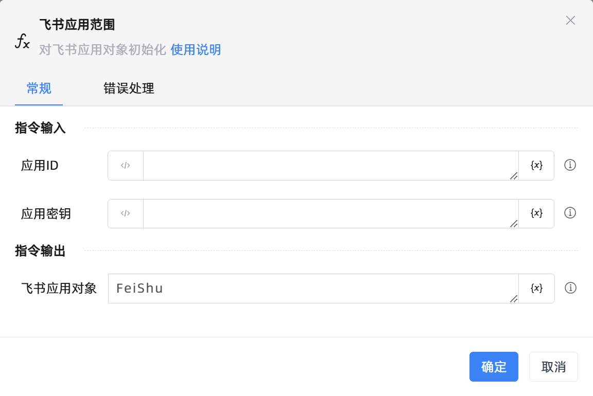

# 飞书应用范围

## 功能说明

:::tip 功能描述
对飞书应用对象初始化
:::

## 配置项说明

### 常规

**指令输入**

- **应用ID**`String`: 请输入飞书应用的唯一ID标识

- **应用密钥**`String`: 请输入飞书的应用密钥

**指令输出**

- **飞书应用对象**`TFeiShu`: 返回应用ID和密钥获取到的飞书应用对象

### 错误处理

- **打印错误日志**`Boolean`：当指令运行出错时，打印错误日志到【日志】面板。默认勾选。

- **处理方式**`Integer`：

 - **终止流程**：指令运行出错时，终止流程。

 - **忽略异常并继续执行**：指令运行出错时，忽略异常，继续执行流程。

 - **重试此指令**：指令运行出错时，重试运行指定次数指令，每次重试间隔指定时长。

## 使用示例
无

## 常见错误及处理

无

## 常见问题解答

无

