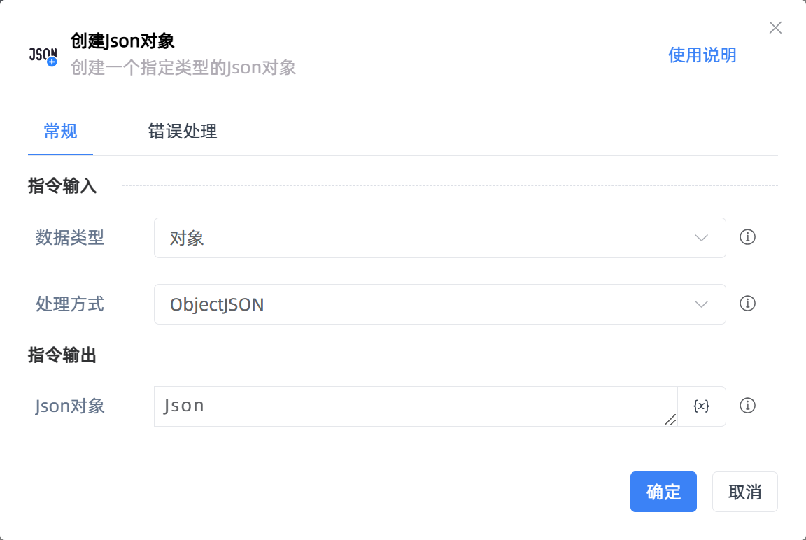

# 创建Json对象
- 适用系统: windows / 信创

## 功能说明

:::tip 功能描述
创建一个指定类型的Json对象
:::

## 配置项说明

### 常规

**指令输入**

- **数据类型**`Integer`: 指定数据类型

- **处理方式**`Integer`: Json的处理类型，默认使用原逻辑，第二使用uLkJSON处理逻辑。

**指令输出**

- **Json对象**`TJson`: 返回的Json对象

### 高级

- **执行前的延迟(毫秒)**`Integer`: 指令执行前的等待时间

### 错误处理

- **打印错误日志**`Boolean`：当指令运行出错时，打印错误日志到【日志】面板。默认勾选。

- **处理方式**`Integer`：

 - **终止流程**：指令运行出错时，终止流程。

 - **忽略异常并继续执行**：指令运行出错时，忽略异常，继续执行流程。

 - **重试此指令**：指令运行出错时，重试运行指定次数指令，每次重试间隔指定时长。

## 使用示例
无

## 常见错误及处理

无

## 常见问题解答

无

