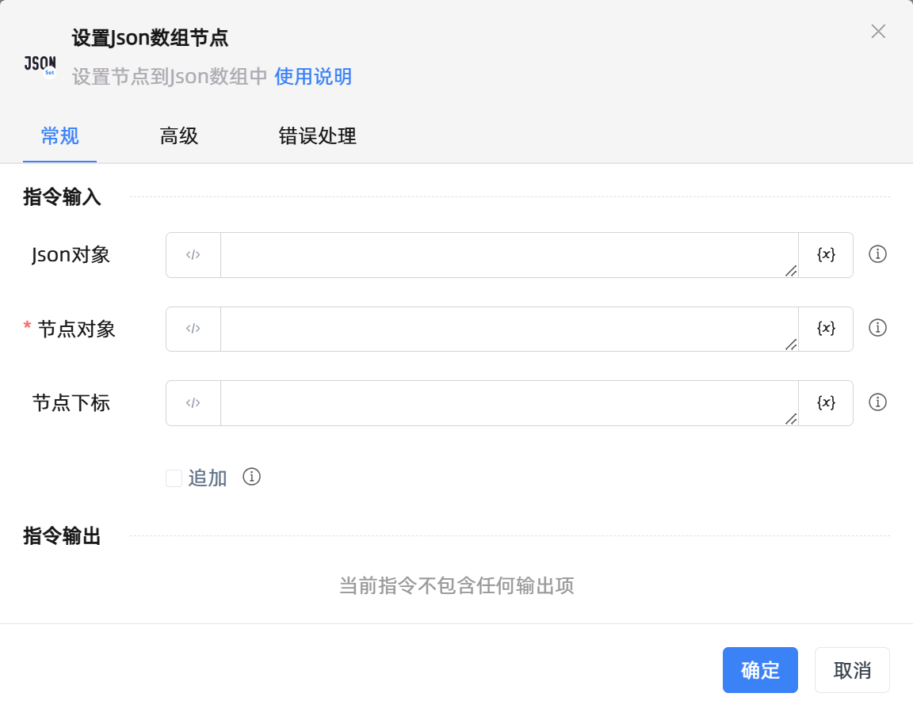

# 设置Json数组节点
- 适用系统: windows / 信创

## 功能说明

:::tip 功能描述
设置节点到Json数组中
:::

## 配置项说明

### 常规

**指令输入**

- **Json对象**`TJson`: 指定Json对象

- **节点对象**`TJson`: 指定节点对象

- **节点下标**`Integer`: 设置节点下标

- **追加**`Boolean`: 勾选后则追加到数组中，忽略'节点下标'

**指令输出**

当前指令无输出

### 高级

- **执行前的延迟(毫秒)**`Integer`: 指令执行前的等待时间

### 错误处理

- **打印错误日志**`Boolean`：当指令运行出错时，打印错误日志到【日志】面板。默认勾选。

- **处理方式**`Integer`：

 - **终止流程**：指令运行出错时，终止流程。

 - **忽略异常并继续执行**：指令运行出错时，忽略异常，继续执行流程。

 - **重试此指令**：指令运行出错时，重试运行指定次数指令，每次重试间隔指定时长。

## 使用示例
无

## 常见错误及处理

无

## 常见问题解答

无

