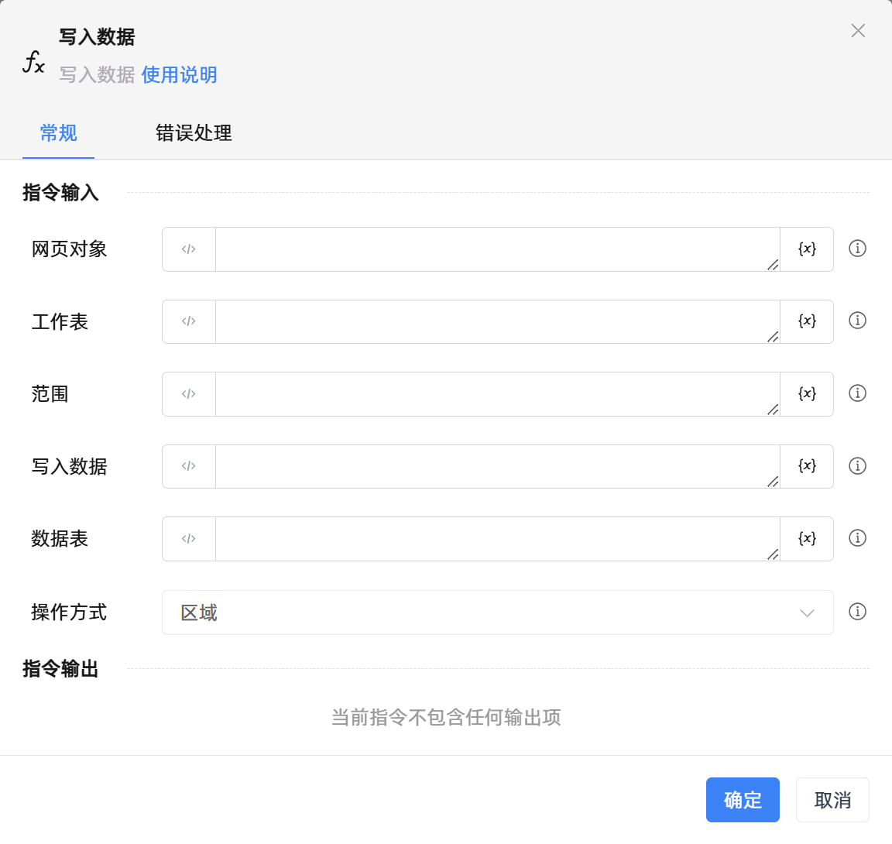

# 写入数据

## 功能说明

:::tip 功能描述
写入数据
:::

## 配置项说明

### 常规

**指令输入**

- **网页对象**`TWPSDocument`: 输入的网页对象

- **工作表**`String`: 工作表名称

- **范围**`String`: 指定范围:单元格A1,区域:A1:B2,行:2,列:A

- **写入数据**`String`: 格式:[[],[],[]]表示三行

- **数据表**`TDataTable`: 填了该参数，写入数据不需要再填，两填一即可

- **操作方式**`Integer`: 单元格, 行, 列, 区域

**指令输出**

当前指令无输出

### 错误处理

- **打印错误日志**`Boolean`：当指令运行出错时，打印错误日志到【日志】面板。默认勾选。

- **处理方式**`Integer`：

 - **终止流程**：指令运行出错时，终止流程。

 - **忽略异常并继续执行**：指令运行出错时，忽略异常，继续执行流程。

 - **重试此指令**：指令运行出错时，重试运行指定次数指令，每次重试间隔指定时长。

## 使用示例
无

## 常见错误及处理

无

## 常见问题解答

无

