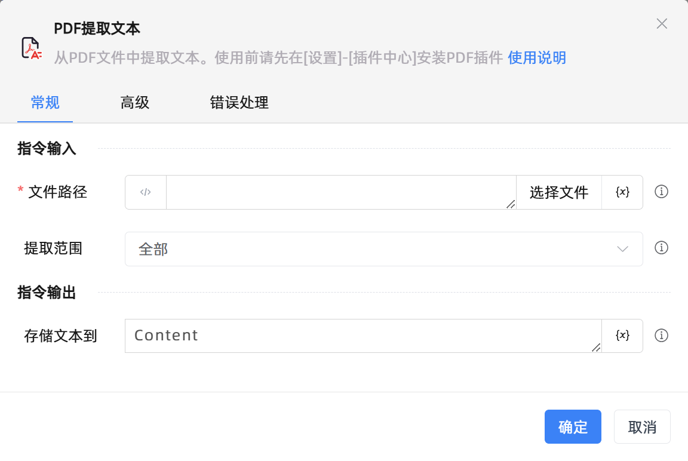

# PDF提取文本

## 功能说明

:::tip 功能描述
从PDF文件中提取文本。使用前请先在[设置]-[插件中心]安装PDF插件
:::

## 配置项说明

### 常规

**指令输入**

- **文件路径**`string`: 请填写PDF文件路径

- **提取范围**`Integer`: 指定提取页码范围

- **页码**`Integer`: 填写待提取的单页页码。页码索引从1开始

- **开始页码**`Integer`: 填写待提取的开始页码。页码索引从1开始

- **终止页码**`Integer`: 填写待提取的终止页码。页码索引从1开始

**指令输出**

- **存储文本到**`string`: 指定一个变量，用来存储文本

### 高级

- **使用密码**`Boolean`: 打开文件是否需要输入密码

- **密码**`string`: 输入打开文件需要的密码

- **执行前的延迟(毫秒)**`Integer`: 指令执行前的等待时间

### 错误处理

- **打印错误日志**`Boolean`：当指令运行出错时，打印错误日志到【日志】面板。默认勾选。

- **处理方式**`Integer`：

 - **终止流程**：指令运行出错时，终止流程。

 - **忽略异常并继续执行**：指令运行出错时，忽略异常，继续执行流程。

 - **重试此指令**：指令运行出错时，重试运行指定次数指令，每次重试间隔指定时长。

## 使用示例
无

## 常见错误及处理

无

## 常见问题解答

无

