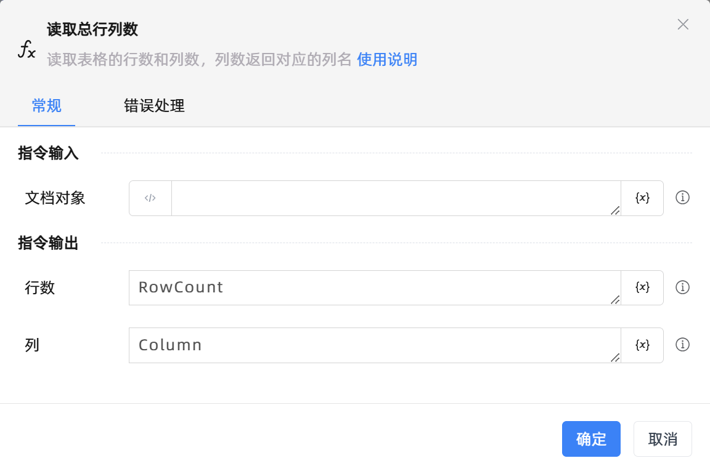

# 读取总行列数

## 功能说明

:::tip 功能描述
读取表格的行数和列数，列数返回对应的列名
:::

## 配置项说明

### 常规

**指令输入**

- **文档对象**`TDocument`: 完成初始化的腾讯在线文档表格对象

**指令输出**

- **行数**`Integer`: 

- **列**`string`: 

### 错误处理

- **打印错误日志**`Boolean`：当指令运行出错时，打印错误日志到【日志】面板。默认勾选。

- **处理方式**`Integer`：

 - **终止流程**：指令运行出错时，终止流程。

 - **忽略异常并继续执行**：指令运行出错时，忽略异常，继续执行流程。

 - **重试此指令**：指令运行出错时，重试运行指定次数指令，每次重试间隔指定时长。

## 使用示例
无

## 常见错误及处理

无

## 常见问题解答

无

