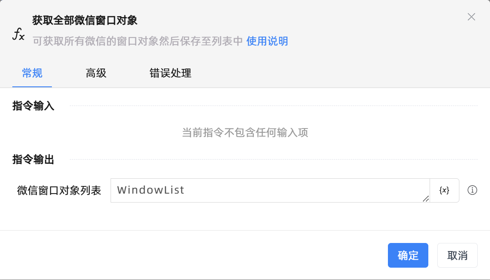

# 获取全部微信窗口对象
- 适用系统: windows

## 功能说明

:::tip 功能描述
可获取所有微信的窗口对象然后保存至列表中
:::

## 配置项说明

### 常规

**指令输入**

当前指令无输入

**指令输出**

- **微信窗口对象列表**`TList<TUiElement>`: 返回微信窗口对象的列表

### 高级

- **执行前的延迟(毫秒)**`Integer`: 指令执行前的等待时间

### 错误处理

- **打印错误日志**`Boolean`：当指令运行出错时，打印错误日志到【日志】面板。默认勾选。

- **处理方式**`Integer`：

 - **终止流程**：指令运行出错时，终止流程。

 - **忽略异常并继续执行**：指令运行出错时，忽略异常，继续执行流程。

 - **重试此指令**：指令运行出错时，重试运行指定次数指令，每次重试间隔指定时长。

## 使用示例
无

## 常见错误及处理

无

## 常见问题解答

无

