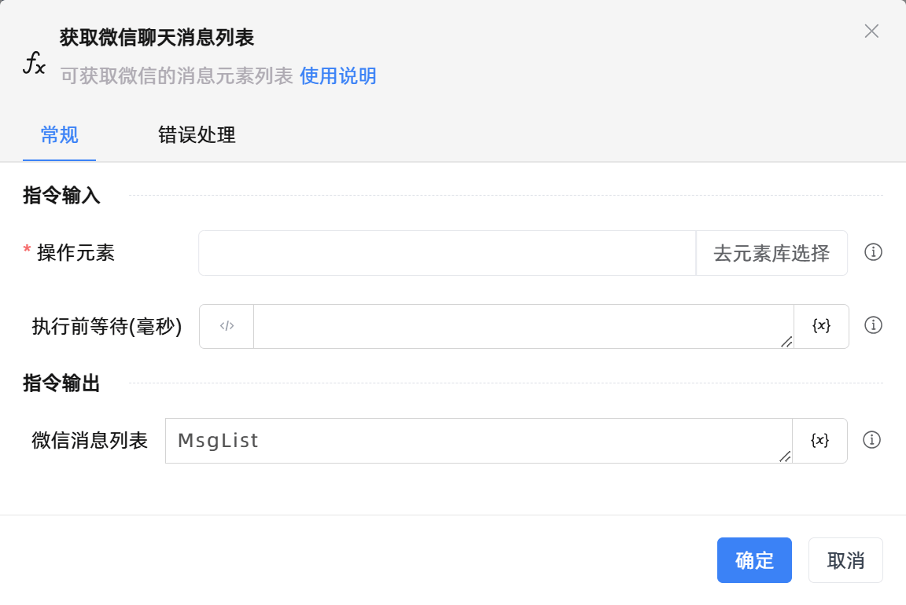

# 获取微信聊天消息列表

## 功能说明

:::tip 功能描述
可获取微信的消息元素列表
:::

## 配置项说明

### 常规

**指令输入**

- **操作元素**`TTarget`: 指明微信的操作元素，请使用uia模式抓取微信的最外层窗口, uia模式无法抓取，该参数可为空

- **执行前等待(毫秒)**`Integer`: 执行前等待加载时间（以毫秒为单位）

**指令输出**

- **微信消息列表**`TList<TUiElement>`: 返回微信的消息元素列表

### 错误处理

- **打印错误日志**`Boolean`：当指令运行出错时，打印错误日志到【日志】面板。默认勾选。

- **处理方式**`Integer`：

 - **终止流程**：指令运行出错时，终止流程。

 - **忽略异常并继续执行**：指令运行出错时，忽略异常，继续执行流程。

 - **重试此指令**：指令运行出错时，重试运行指定次数指令，每次重试间隔指定时长。

## 使用示例
无

## 常见错误及处理

无

## 常见问题解答

无

