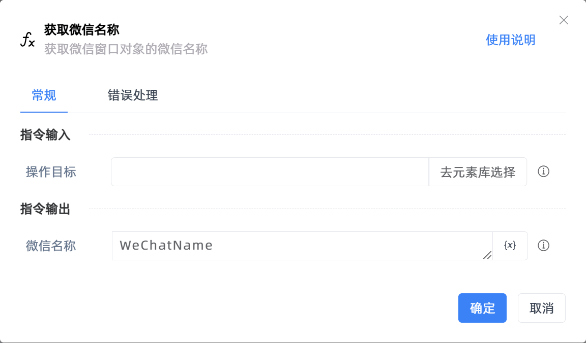

# 获取微信名称

## 功能说明

:::tip 功能描述
获取微信窗口对象的微信名称
:::

## 配置项说明

### 常规

**指令输入**

- **操作目标**`TTarget`: Target, 指明微信操作元素，请抓取的微信的最外层窗口

**指令输出**

- **微信名称**`string`: 微信窗口对象对应的微信名称

### 高级

- **执行前延迟(毫秒)**`Integer`: 指令执行前等待的时间

### 错误处理

- **打印错误日志**`Boolean`：当指令运行出错时，打印错误日志到【日志】面板。默认勾选。

- **处理方式**`Integer`：

 - **终止流程**：指令运行出错时，终止流程。

 - **忽略异常并继续执行**：指令运行出错时，忽略异常，继续执行流程。

 - **重试此指令**：指令运行出错时，重试运行指定次数指令，每次重试间隔指定时长。

## 使用示例

**流程逻辑描述：** 

## 常见错误及处理

无

## 常见问题解答

无

