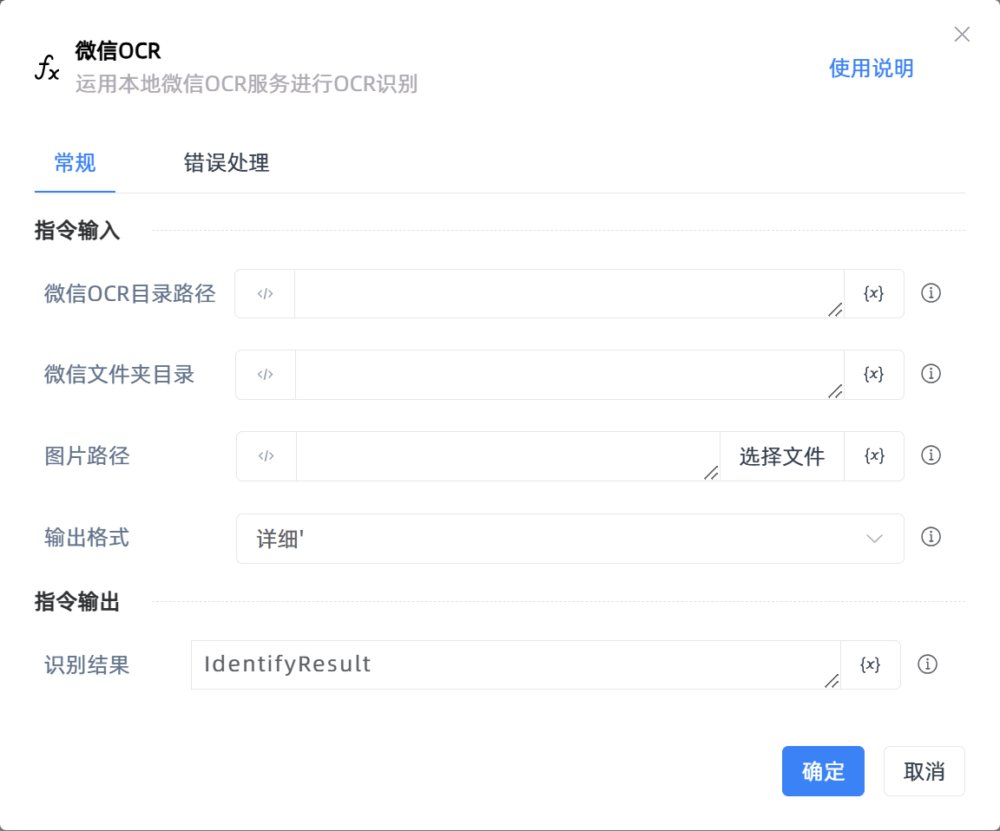

# 微信OCR

## 功能说明

:::tip 功能描述
运用本地微信OCR服务进行OCR识别
:::

## 配置项说明

### 常规

**指令输入**

- **微信OCR目录路径**`string`: WeChatOCR.exe所在文件夹路径，到任务管理器中查看

- **微信文件夹目录**`string`: 微信安装文件夹的目录路径

- **图片路径**`string`: 要识别的图片路径

- **输出格式**`Integer`: 输出格式，可选【详细】和【精简】，【详细】：文字,坐标和识别率，【精简】：文字

**指令输出**

- **识别结果**`string`: 经过微信OCR识别出来的结果

### 高级

- **执行前延迟(毫秒)**`Integer`: 指令执行前等待的时间

### 错误处理

- **打印错误日志**`Boolean`：当指令运行出错时，打印错误日志到【日志】面板。默认勾选。

- **处理方式**`Integer`：

 - **终止流程**：指令运行出错时，终止流程。

 - **忽略异常并继续执行**：指令运行出错时，忽略异常，继续执行流程。

 - **重试此指令**：指令运行出错时，重试运行指定次数指令，每次重试间隔指定时长。

## 使用示例

**流程逻辑描述：** 

## 常见错误及处理

无

## 常见问题解答

无

