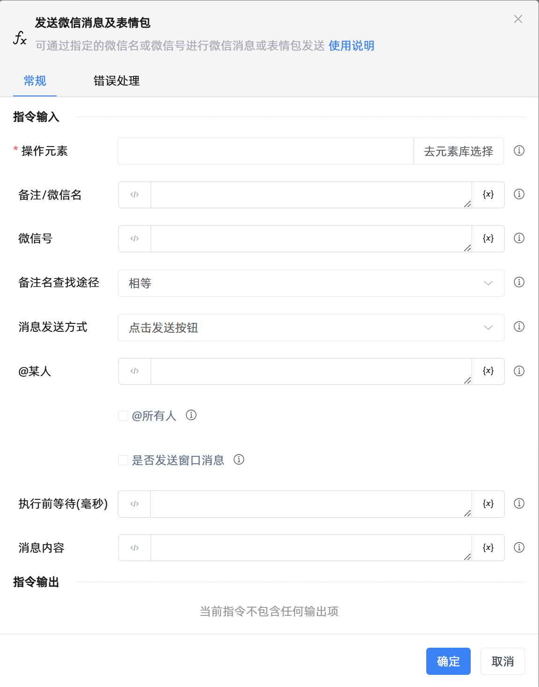

# 发送微信消息及表情包

## 功能说明

:::tip 功能描述
可通过指定的微信名或微信号进行微信消息或表情包发送
:::

## 配置项说明

### 常规

**指令输入**

- **操作元素**`TTarget`: 指明微信的操作元素，请使用uia模式抓取微信的最外层窗口, uia模式无法抓取，该参数可为空

- **备注/微信名**`string`: 优先根据备注/微信名来搜索

- **微信号**`string`: 可通过指定的微信号给某人发送消息

- **备注名查找途径**`Integer`: 备注名支持的查找方式，可选择相等查询或模糊查询

- **消息发送方式**`Integer`: 支持的发送方式，可选择点击发送按钮、快捷键Ctrl+Enter或快捷键Enter

- **@某人**`TList<String>`: 请输入需要@的人的微信名列表，微信名列表需要通过构造字符串列表来创建

- **@所有人**`Boolean`: 选中@所有人选项后，若无此权限将引发错误；若已选中@所有人，则@某人将不起作用

- **是否发送窗口消息**`Boolean`: 勾选后将通过后台来发送微信消息

- **执行前等待(毫秒)**`Integer`: 执行前等待加载时间（以毫秒为单位）

- **消息内容**`string`: 请输入需要发送的消息

**指令输出**

当前指令无输出

### 错误处理

- **打印错误日志**`Boolean`：当指令运行出错时，打印错误日志到【日志】面板。默认勾选。

- **处理方式**`Integer`：

 - **终止流程**：指令运行出错时，终止流程。

 - **忽略异常并继续执行**：指令运行出错时，忽略异常，继续执行流程。

 - **重试此指令**：指令运行出错时，重试运行指定次数指令，每次重试间隔指定时长。

## 使用示例

**流程逻辑描述：** 

## 常见错误及处理

无

## 常见问题解答

无

