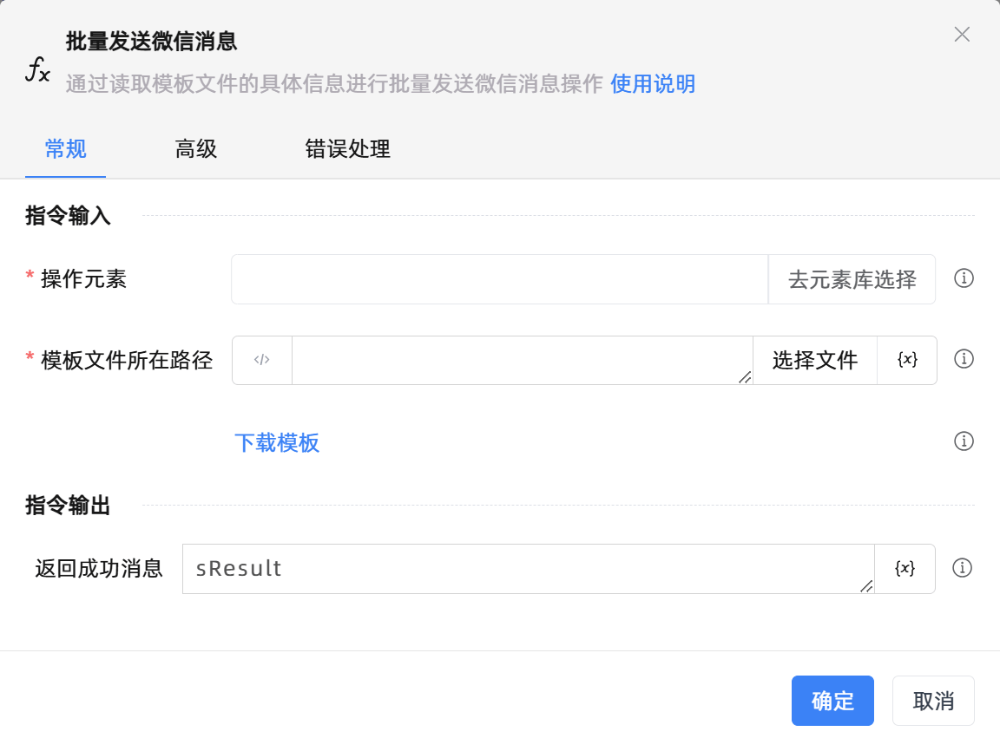

# 批量发送微信消息

## 功能说明

:::tip 功能描述
通过读取模板文件的具体信息进行批量发送微信消息操作
:::

## 配置项说明

### 常规

**指令输入**

- **操作元素**`TTarget`: 指明微信的操作元素，请使用uia模式抓取微信的最外层窗口, uia模式无法抓取，该参数可为空

- **模板文件所在路径**`string`: 请输入或选择模板文件路径

- **模板文件下载**`Boolean`: 下载模板文件至指定的目录

**指令输出**

- **返回成功消息**`TList<String>`: 

### 高级

- **执行前的延迟(毫秒)**`Integer`: 指令执行前的等待时间

### 错误处理

- **打印错误日志**`Boolean`：当指令运行出错时，打印错误日志到【日志】面板。默认勾选。

- **处理方式**`Integer`：

 - **终止流程**：指令运行出错时，终止流程。

 - **忽略异常并继续执行**：指令运行出错时，忽略异常，继续执行流程。

 - **重试此指令**：指令运行出错时，重试运行指定次数指令，每次重试间隔指定时长。

## 使用示例

**流程逻辑描述：** 

## 常见错误及处理

无

## 常见问题解答

无

