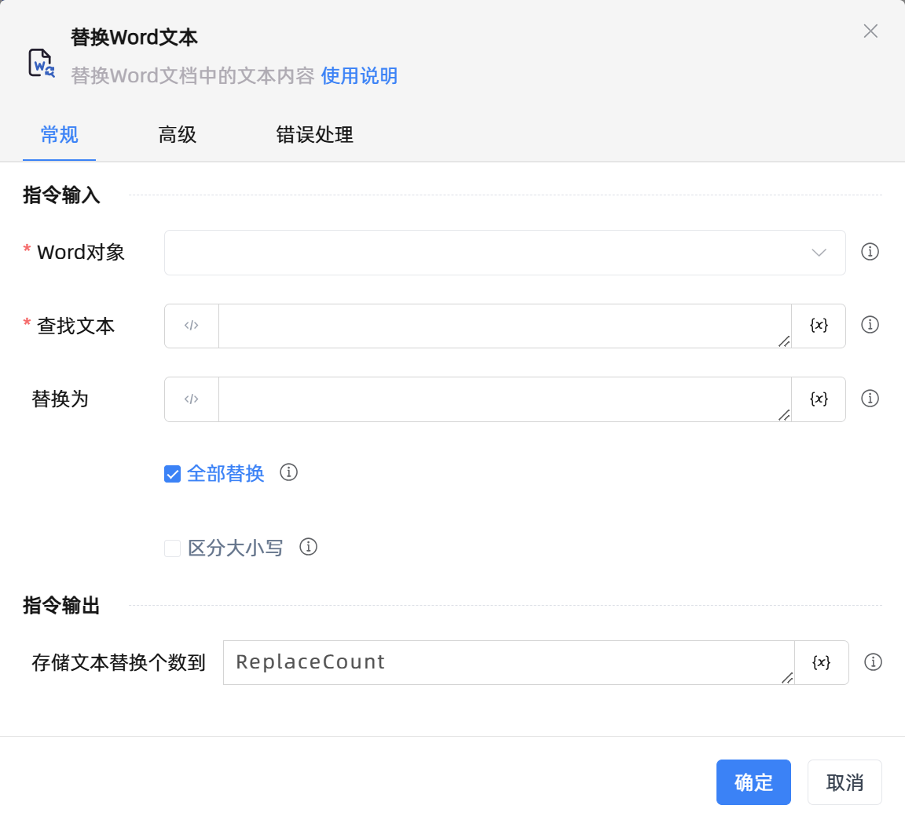

# 替换Word文本

## 功能说明

:::tip 功能描述
替换Word文档中的文本内容
:::

## 配置项说明

### 常规

**指令输入**

- **Word对象**`TDocumentApplication`: 输入一个通过函数'打开/新建Word'返回的Word对象

- **查找文本**`string`: 输入要查找文本

- **替换为**`string`: 输入要替换的文本

- **全部替换**`Boolean`: 勾选后,将替换全部查找到的文本内容

- **区分大小写**`Boolean`: 文本信息区分大小写

**指令输出**

- **存储文本替换个数到**`Integer`: 指定一个变量名称,该变量用于存储文本替换个数

### 高级

- **执行前的延迟(毫秒)**`Integer`: 指令执行前的等待时间

### 错误处理

- **打印错误日志**`Boolean`：当指令运行出错时，打印错误日志到【日志】面板。默认勾选。

- **处理方式**`Integer`：

 - **终止流程**：指令运行出错时，终止流程。

 - **忽略异常并继续执行**：指令运行出错时，忽略异常，继续执行流程。

 - **重试此指令**：指令运行出错时，重试运行指定次数指令，每次重试间隔指定时长。

## 使用示例

**流程逻辑描述：** 

## 常见错误及处理

无

## 常见问题解答

无

