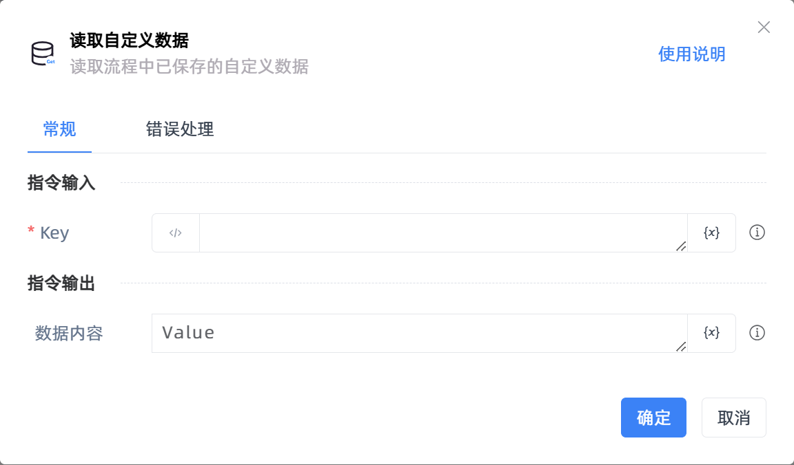

# 读取自定义数据
- 适用系统: windows / 信创

## 功能说明

:::tip 功能描述
读取流程中已保存的自定义数据
:::

## 配置项说明

### 常规

**指令输入**

- **Key**`string`: 根据【保存自定义数据】指令中指定的 Key 读取数据

**指令输出**

- **数据内容**`string`: 将读取到的自定义数据内容保存到指定变量中，若未找到对应 Key，则返回空值

### 错误处理

- **打印错误日志**`Boolean`：当指令运行出错时，打印错误日志到【日志】面板。默认勾选。

- **处理方式**`Integer`：

 - **终止流程**：指令运行出错时，终止流程。

 - **忽略异常并继续执行**：指令运行出错时，忽略异常，继续执行流程。

 - **重试此指令**：指令运行出错时，重试运行指定次数指令，每次重试间隔指定时长。

## 使用示例

  - [点击下载查看示例](https://files.oss.krpalite.com:56780/%E5%BA%94%E7%94%A8/%E7%A4%BA%E4%BE%8B_%E4%BF%9D%E5%AD%98%E5%92%8C%E8%AF%BB%E5%8F%96%E8%87%AA%E5%AE%9A%E4%B9%89%E6%95%B0%E6%8D%AE.krpa) 

