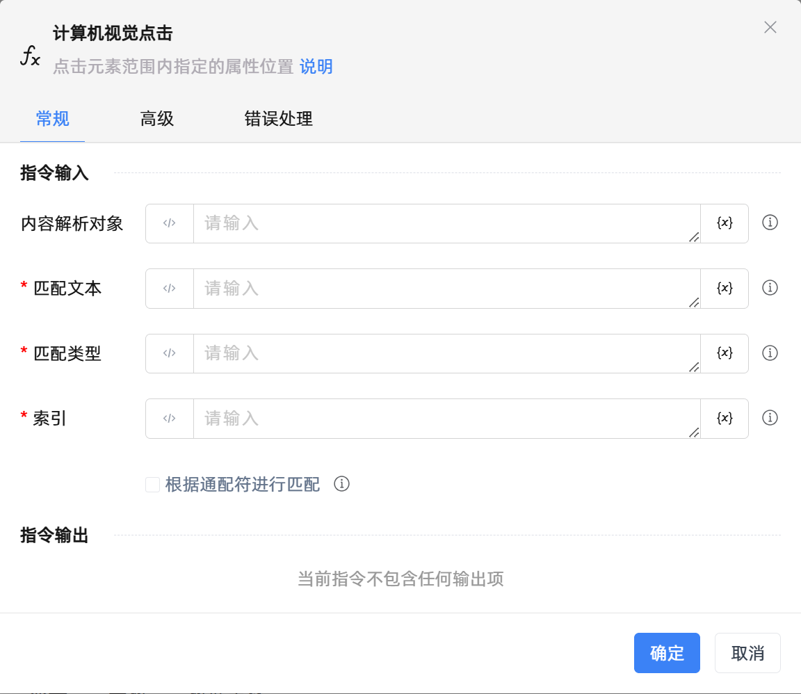

# 计算机视觉点击

## 功能说明

:::tip 功能描述
点击元素范围内指定的属性位置
:::

## 配置项说明

### 常规

**指令输入**

- **内容解析对象**`TScreenTask`: 选择元素范围函数返回的对象

- **匹配文本**`string`: 根据输入的文本来做匹配

- **匹配类型**`string`: 根据输入的类型来做匹配

- **索引**`Integer`: 选择符合要求的第几个结果

- **根据通配符进行匹配**`Boolean`: 根据通配符进行匹配

**指令输出**

当前指令无输出

### 高级

- **显示鼠标移动轨迹**`Boolean`: 是否显示鼠标移动的轨迹

- **点击方式**`Integer`: 请选择单击亦或是双击

- **鼠标按钮**`Integer`: 触发点击鼠标按键

- **键盘辅助按钮**`Integer`: 需按下的键盘功能键

- **执行前的延迟(毫秒)**`Integer`: 指令执行前的等待时间

- **目标文本的部位**`Integer`: 支持在元素中心位置(元素矩形区域的中心点)、随机位置(自动随机指定元素矩形范围内的点)、自定义位置(手动指定目标点)进行点击

- **自定义**`Integer`: 自定义位置

- **横向移动**`Integer`: 如果输入的是正数，则会向右移动，如果输入的是负数，则会向左移动

- **纵向移动**`Integer`: 如果输入的是正数，则会向下移动，如果输入的是负数，则会向上移动

### 错误处理

- **打印错误日志**`Boolean`：当指令运行出错时，打印错误日志到【日志】面板。默认勾选。

- **处理方式**`Integer`：

 - **终止流程**：指令运行出错时，终止流程。

 - **忽略异常并继续执行**：指令运行出错时，忽略异常，继续执行流程。

 - **重试此指令**：指令运行出错时，重试运行指定次数指令，每次重试间隔指定时长。

## 使用示例

**流程逻辑描述：** 

## 常见错误及处理

无

## 常见问题解答

无

