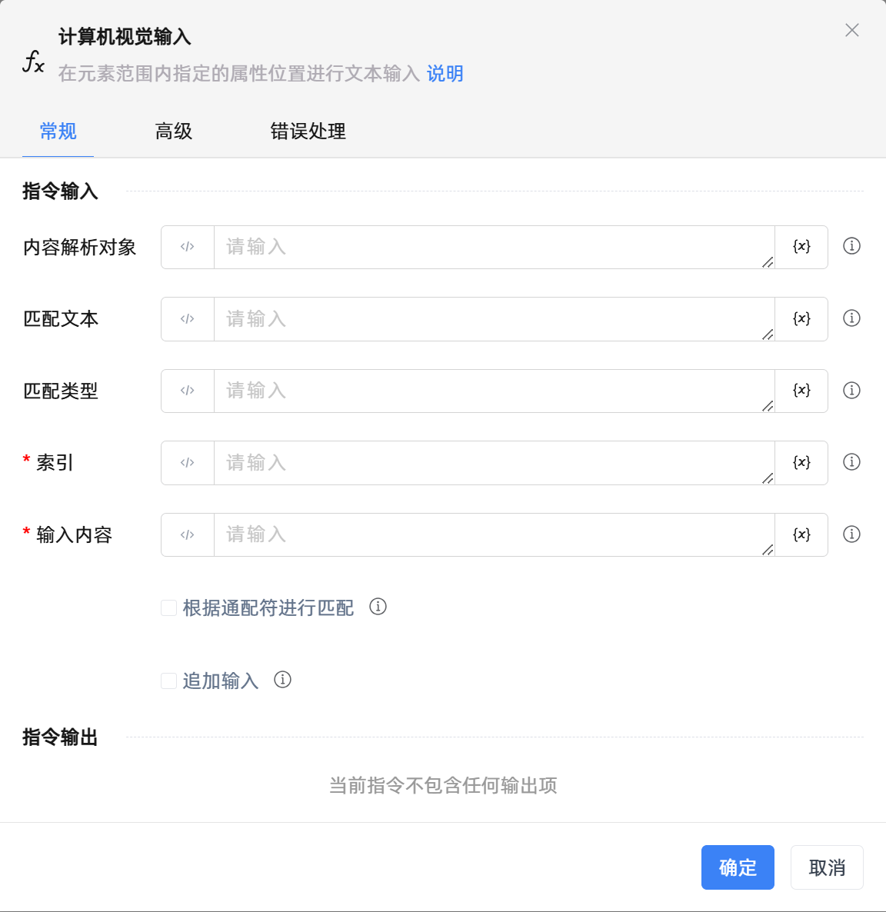

# 计算机视觉输入
- 适用系统: windows / 信创

## 功能说明

:::tip 功能描述
在元素范围内指定的属性位置进行文本输入
:::

## 配置项说明

### 常规

**指令输入**

- **内容解析对象**`TScreenTask`: 选择元素范围函数返回的对象

- **匹配文本**`string`: 根据输入的文本来做匹配

- **匹配类型**`string`: 根据输入的类型来做匹配

- **索引**`Integer`: 选择符合要求的第几个结果

- **输入内容**`string`: 要输入的内容

- **根据通配符进行匹配**`Boolean`: 根据通配符进行匹配

- **追加输入**`Boolean`: 若选择此选项，则在现有的内容后续输入，否则将清空内容后重新输入

**指令输出**

当前指令无输出

### 高级

- **输入前点击元素**`Boolean`: 在输入动作前，会先点击元素

- **按键输入间隔(毫秒)**`Integer`: 两次按键的时间间隔，范围在0到1000之间

- **焦点超时时间(毫秒)**`Integer`: 焦点超时时间

- **执行前的延迟(毫秒)**`Integer`: 指令执行前的等待时间

- **鼠标点击位置**`Integer`: 支持在元素中心位置(元素矩形区域的中心点)、随机位置(自动随机指定元素矩形范围内的点)、自定义位置(手动指定目标点)进行点击

- **自定义**`Integer`: 自定义位置

- **横向移动**`Integer`: 如果输入的是正数，则会向右移动，如果输入的是负数，则会向左移动

- **纵向移动**`Integer`: 如果输入的是正数，则会向下移动，如果输入的是负数，则会向上移动

### 错误处理

- **打印错误日志**`Boolean`：当指令运行出错时，打印错误日志到【日志】面板。默认勾选。

- **处理方式**`Integer`：

 - **终止流程**：指令运行出错时，终止流程。

 - **忽略异常并继续执行**：指令运行出错时，忽略异常，继续执行流程。

 - **重试此指令**：指令运行出错时，重试运行指定次数指令，每次重试间隔指定时长。

## 使用示例
无

## 常见错误及处理

无

## 常见问题解答

无

