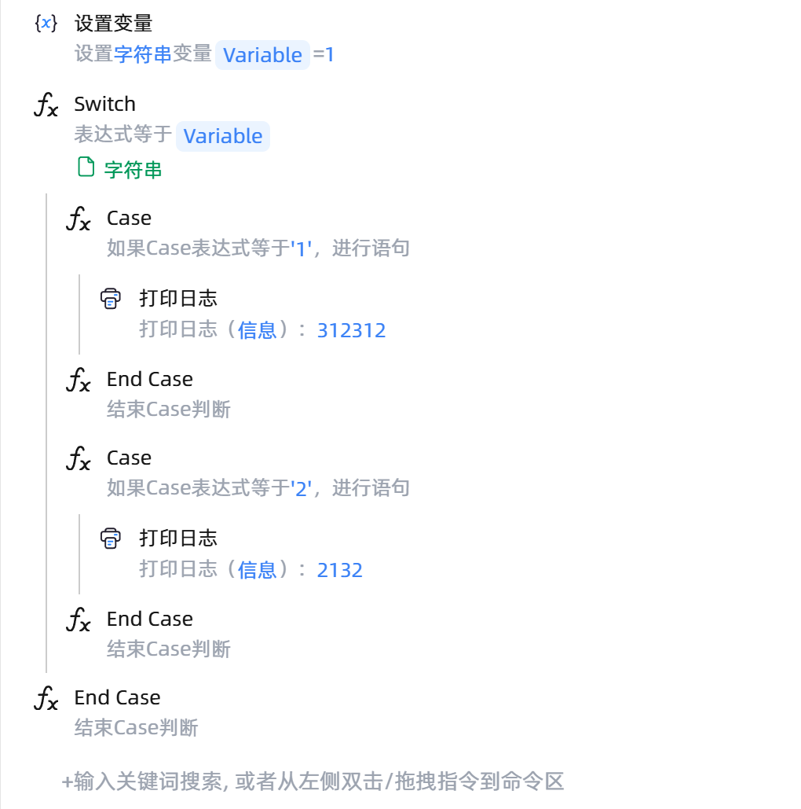

# Case
- 适用系统: windows / 信创

## 功能说明

:::tip 功能描述
Case多分支选择结构，用于根据一个表达式的不同值执行不同的代码块
:::

## 常规

### 指令输入

**值**:
  设置一个变量与Case进行匹配 如果是字符串需要用单引号

## 使用示例

**流程逻辑描述：**: 
  使用Switch函数 设置一个对照值 配合Case函数 进行匹配并执行匹配成功的代码块
