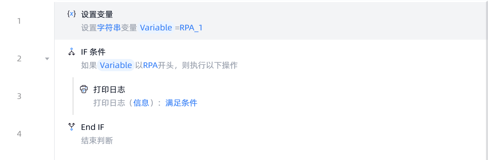

# IF 条件

## 功能说明

:::tip 功能描述
作为条件判断的开始标记
:::

## 指令输入

- **对象1**: 
	- 在默认的文本模式下直接输入文本
  	- 在编程模式下输入表达式
	- 通过`{x}`选择已创建的变量

 

- **关系**: 选择对象1和对象2的比较方式，如："对象1等于对象2"、"对象1包含对象2"、"对象1以对象2开头"等方式

 

- **对象2**: 内容的输入方式与对象1相同，当判断条件只需要一个对象时，对象2可缺省，如："对象1等于True"、"对象1是空值"等方式

## 使用示例

 

**流程逻辑描述**：设置字符串类型变量值为"RPA_1"--> 使用【IF 条件】指令判断变量是否以'RPA'开头-->若满足条件则执行【打印日志】指令打印"满足条件"

