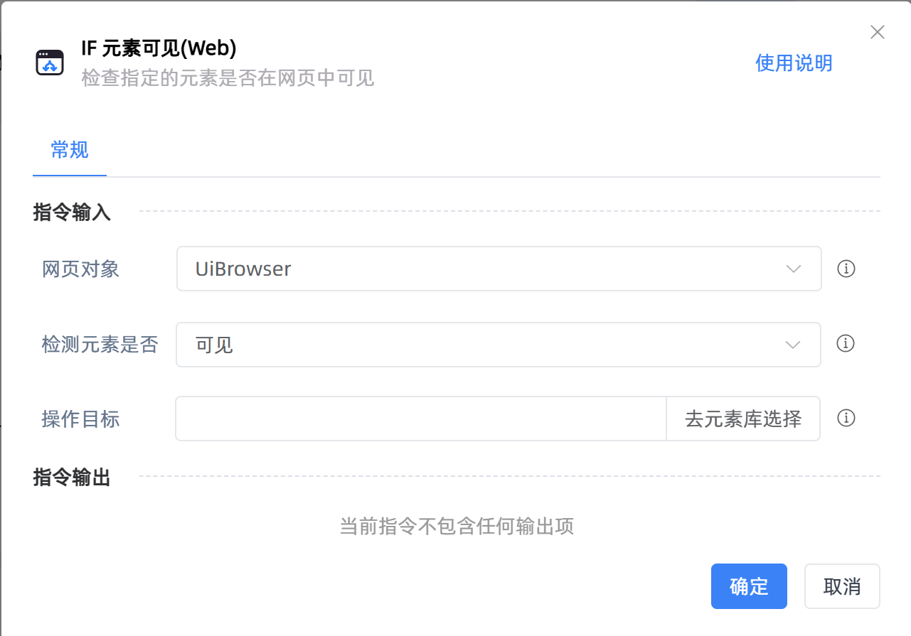

# IF 元素可见(Web)

## 功能说明

:::tip 功能描述
检查指定的元素在网页中是否可见
:::

## 配置项说明

### 常规

**指令输入**

- **网页对象**`TBrowser`: 选择一个通过【打开网页】或【获取已打开的网页对象】创建的网页对象
- **检测元素是否**`Integer`: 选择检查元素在网页中可见或者不可见

- **操作目标**`TTarget`: 从「元素库」中选择一个已捕获的元素或通过「捕获新元素」来捕获新的网页元素作为操作目标

**指令输出**

当前指令无输出

## 使用示例

**流程逻辑描述：**使用【打开网页】指令打开百度知道 --> 判断网页中指定元素是否可见 --> 若可见则执行【点击元素(web)】点击该元素

## 常见错误及处理

无

## 常见问题解答

无

