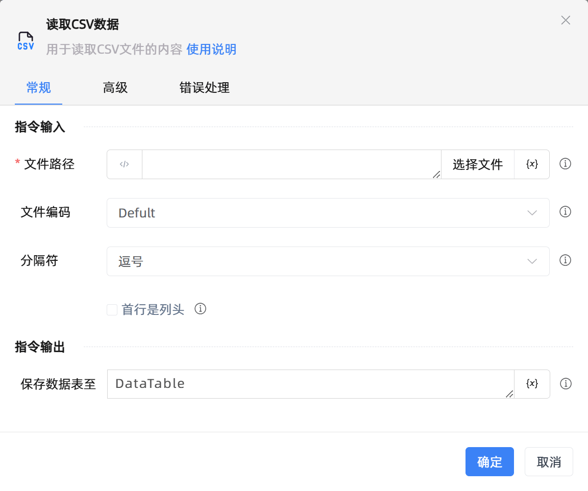
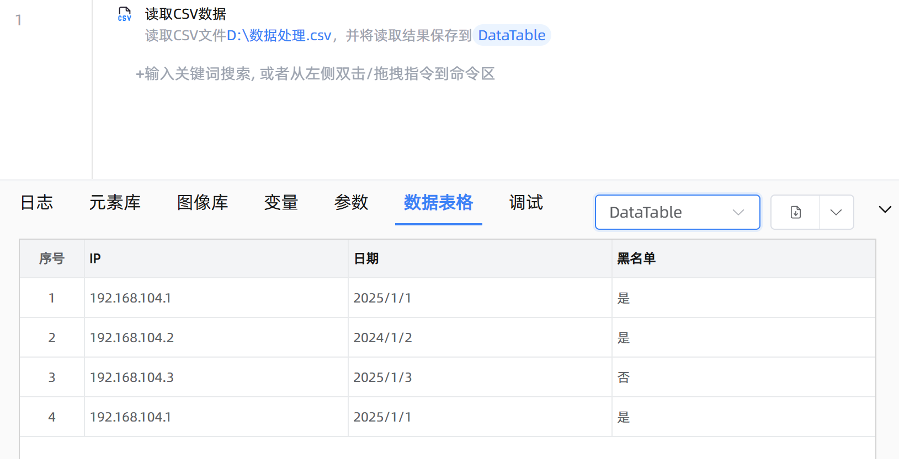

# 读取CSV数据

## 功能说明

:::tip 功能描述
用于读取CSV文件的内容
:::

## 配置项说明

### 常规

**指令输入**

- **文件路径**`string`: 请输入CSV文件路径

- **文件编码**`Integer`: 选择文件的文本编码格式，UTF-8-SIG为带有BOM的UTF-8

- **分隔符**`Integer`: 选择内容分隔符，默认分隔符是英文逗号

- **首行是列头**`Boolean`: 首行是否是列头。注意确保首行每列数据的唯一性

- **在数据表中预览**`Boolean`: 是否在数据表格Tab中预览数据

**指令输出**

- **保存数据表至**`TDataTable`: 指定一个变量，用于保存读取的数据表

### 高级

- **执行前的延迟(毫秒)**`Integer`: 指令执行前的等待时间

### 错误处理

- **打印错误日志**`Boolean`：当指令运行出错时，打印错误日志到【日志】面板。默认勾选。

- **处理方式**`Integer`：

    - **终止流程**：指令运行出错时，终止流程。

    - **忽略异常并继续执行**：指令运行出错时，忽略异常，继续执行流程。

    - **重试此指令**：指令运行出错时，重试运行指定次数指令，每次重试间隔指定时长。

## 使用示例

**流程逻辑描述：** 使用【读取CSV数据】指令,勾选输入参数'在数据表中预览' --> 运行指令，然后在数据表格Tab中选择数据表变量进行预览

## 常见错误及处理

无

## 常见问题解答

无

