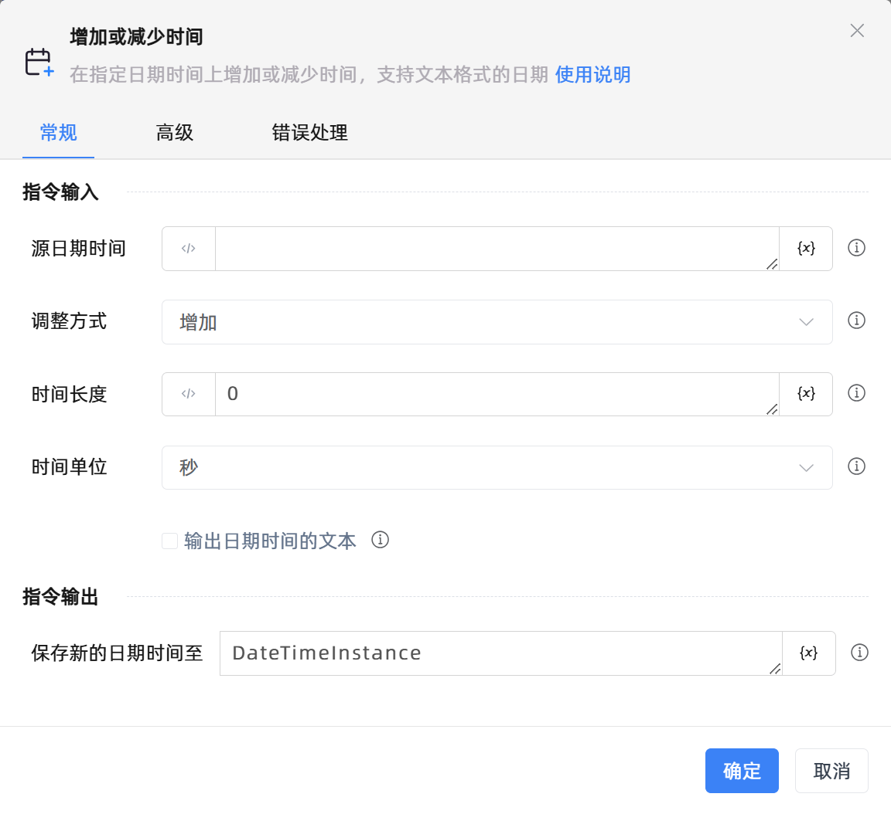

# 增加或减少时间

## 功能说明

:::tip 功能描述
在指定日期时间上增加或减少时间，支持文本格式的日期
:::

## 配置项说明

### 常规

**指令输入**

- **源日期时间**`TDateTime`: 输入一个日期时间对象

- **调整方式**`Integer`: 请选择增加时间还是减少时间

- **时间长度**`Integer`: 请输入时间长度

- **时间单位**`Integer`: 请选择时间单位

- **输出日期时间的文本**`Boolean`: 若选择此选项，指明该指令的输出为新日期的文本格式，否则为日期时间对象

**指令输出**

- **保存新的日期时间至**`TDateTime`: 指定一个变量，用于保存更改后的日期时间

- **保存新的日期文本至**`string`: 指定一个变量，用于保存更改后的日期时间(文本格式)

### 高级

- **执行前的延迟(毫秒)**`Integer`: 指令执行前的等待时间

### 错误处理

- **打印错误日志**`Boolean`：当指令运行出错时，打印错误日志到【日志】面板。默认勾选。

- **处理方式**`Integer`：

 - **终止流程**：指令运行出错时，终止流程。

 - **忽略异常并继续执行**：指令运行出错时，忽略异常，继续执行流程。

 - **重试此指令**：指令运行出错时，重试运行指定次数指令，每次重试间隔指定时长。

## 使用示例
无

## 常见错误及处理

无

## 常见问题解答

无

