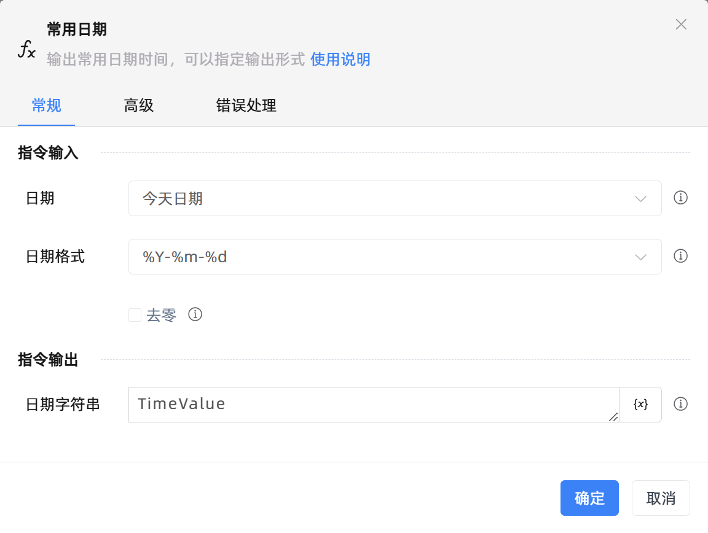
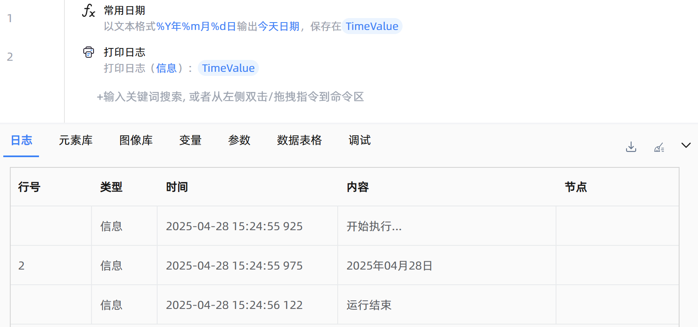

# 常用日期
- 适用系统: windows / 信创

## 功能说明

:::tip 功能描述
输出常用日期时间，可以指定输出形式
:::

## 配置项说明

### 常规

**指令输入**

- **日期**`Integer`: 需要获取的日期，可以选择今日日期、昨日日期、明日日期、本周第一天、本周最后一天等

- **日期格式**`Integer`: 选择日期输出格式。包括：

    - %Y-%m-%d：年-月-日（例如 2025-04-28）

    - %Y-%#m-%#d：年-月-日（去掉前导零，适用于一位数的月份和日期，例如 2025-4-8）

    - %Y/%m/%d：年/月/日（例如 2025/04/28）

    - %Y年%m月%d日：yyyy月mm月dd日（例如 2025年04月28日）

    - %Y年%m月%d日 %H:%M：yyyy年mm月dd日 时:分（例如 2025年04月28日 14:30）

    - %Y/%m/%d %H:%M：年/月/日 时:分（例如 2025/04/28 14:30）

    - %Y/%m/%d %H:%M:%S：年/月/日 时:分:秒（例如 2025/04/28 14:30:45）

- **去零**`Boolean`: 去掉月和日中的 0，如 03 月改为 3 月

**指令输出**

- **日期字符串**`string`: 指定一个变量名称，用于保存指定格式的常用日期

### 高级

- **执行前的延迟(毫秒)**`Integer`: 指令执行前的等待时间

### 错误处理

- **打印错误日志**`Boolean`：当指令运行出错时，打印错误日志到【日志】面板。默认勾选。

- **处理方式**`Integer`：

    - **终止流程**：指令运行出错时，终止流程。

    - **忽略异常并继续执行**：指令运行出错时，忽略异常，继续执行流程。

    - **重试此指令**：指令运行出错时，重试运行指定次数指令，每次重试间隔指定时长。

## 使用示例

**流程逻辑描述：** 使用【常用日期】指令获取今天日期，并以'%Y年%m月%d日'格式输出 --> 使用【打印日志】指令将获取到的日期打印输出

## 常见错误及处理

无

## 常见问题解答

无

