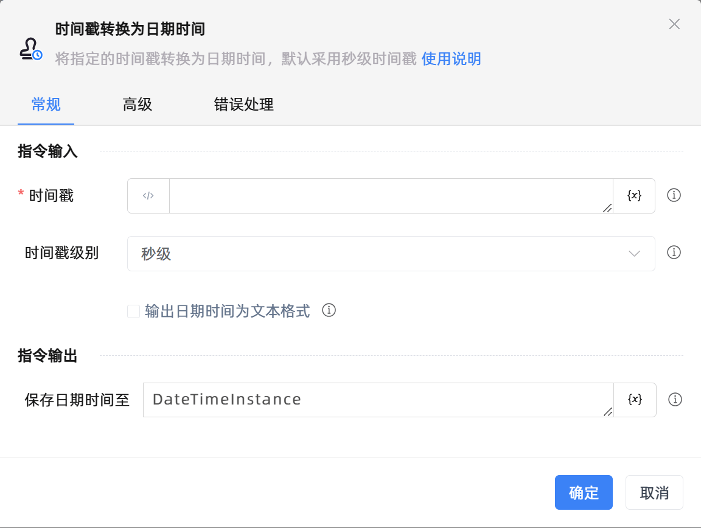

# 时间戳转换为日期时间

## 功能说明

:::tip 功能描述
将指定的时间戳转换为日期时间，默认采用秒级时间戳
:::

## 配置项说明

### 常规

**指令输入**

- **时间戳**`string`: 输入待转换到日期时间的时间戳

- **时间戳级别**`Integer`: 选择时间戳级别：秒级（10 位）、毫秒级（13 位）、微秒级（16 位），不同级别决定时间戳长度

- **输出日期时间为文本格式**`Boolean`: 若选择此选项，则该指令的输出为新日期的文本格式，否则为日期时间对象

**指令输出**

- **保存日期时间至**`TDateTime`: 指定一个变量，用于保存转换后的日期时间

- **保存日期文本至**`string`: 指定一个变量，用于保存转换后的日期时间的文本

### 高级

- **执行前的延迟(毫秒)**`Integer`: 指令执行前的等待时间

### 错误处理

- **打印错误日志**`Boolean`：当指令运行出错时，打印错误日志到【日志】面板。默认勾选。

- **处理方式**`Integer`：

 - **终止流程**：指令运行出错时，终止流程。

 - **忽略异常并继续执行**：指令运行出错时，忽略异常，继续执行流程。

 - **重试此指令**：指令运行出错时，重试运行指定次数指令，每次重试间隔指定时长。

## 使用示例
无

## 常见错误及处理

无

## 常见问题解答

无

