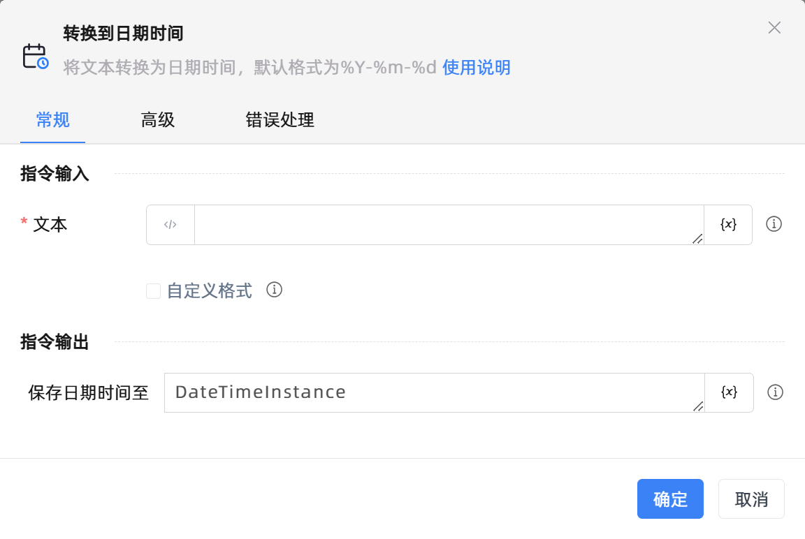

# 转换到日期时间

## 功能说明

:::tip 功能描述
将文本转换为日期时间，默认格式为%Y-%m-%d
:::

## 配置项说明

### 常规

**指令输入**

- **文本**`string`: 输入待转换的文本

- **自定义格式**`Boolean`: 请选择是否使用自定义格式

- **时间格式**`Integer`: 请设置待转换文本的日期时间格式

**指令输出**

- **保存日期时间至**`TDateTime`: 指定一个变量，用于保存转换后的日期时间

### 高级

- **执行前的延迟(毫秒)**`Integer`: 指令执行前的等待时间

### 错误处理

- **打印错误日志**`Boolean`：当指令运行出错时，打印错误日志到【日志】面板。默认勾选。

- **处理方式**`Integer`：

 - **终止流程**：指令运行出错时，终止流程。

 - **忽略异常并继续执行**：指令运行出错时，忽略异常，继续执行流程。

 - **重试此指令**：指令运行出错时，重试运行指定次数指令，每次重试间隔指定时长。

## 使用示例

**流程逻辑描述：** 

## 常见错误及处理

无

## 常见问题解答

无

