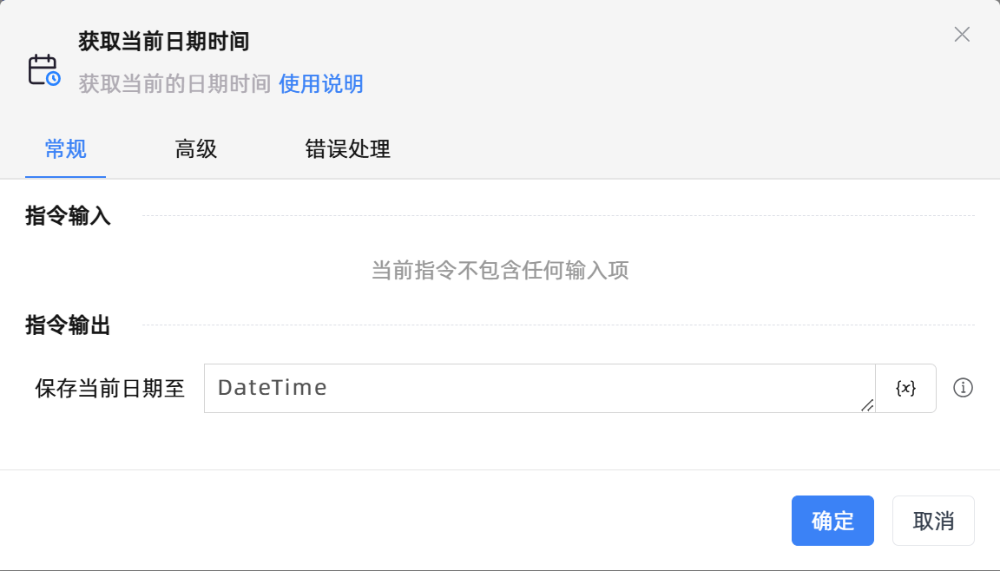
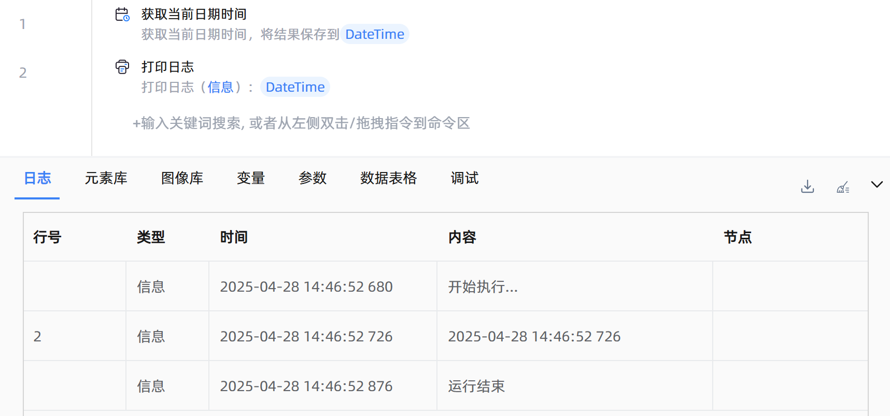

# 获取当前日期时间

## 功能说明

:::tip 功能描述
获取当前的日期时间
:::

## 配置项说明

### 常规

**指令输入**

当前指令无输入

**指令输出**

- **保存当前日期至**`TDateTime`: 指定一个变量，用于保存当前的日期时间

### 高级

- **执行前的延迟(毫秒)**`Integer`: 指令执行前的等待时间

### 错误处理

- **打印错误日志**`Boolean`：当指令运行出错时，打印错误日志到【日志】面板。默认勾选。

- **处理方式**`Integer`：

    - **终止流程**：指令运行出错时，终止流程。

    - **忽略异常并继续执行**：指令运行出错时，忽略异常，继续执行流程。

    - **重试此指令**：指令运行出错时，重试运行指定次数指令，每次重试间隔指定时长。

## 使用示例

**流程逻辑描述：** 使用【获取当前日期时间】指令获取当前的日期和时间 --> 使用【打印日志】指令将获取到的日期时间打印输出

## 常见错误及处理

无

## 常见问题解答

无

