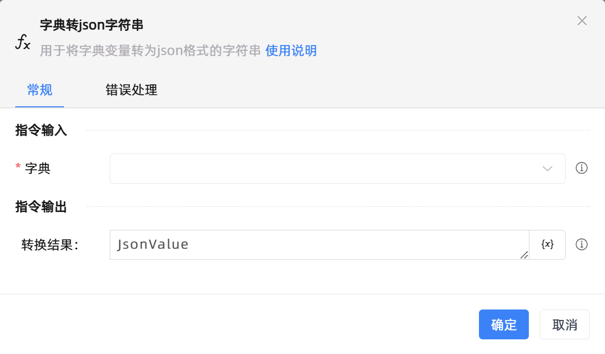

# 字典转json字符串
- 适用系统: windows / 信创

## 功能说明

:::tip 功能描述
用于将字典变量转为json格式的字符串
:::

## 配置项说明

### 常规

**指令输入**

- **字典**`TRPADictionary`: 请输入字典变量

**指令输出**

- **转换结果：**`string`: 字典转字符串输出结果

### 错误处理

- **打印错误日志**`Boolean`：当指令运行出错时，打印错误日志到【日志】面板。默认勾选。

- **处理方式**`Integer`：

    - **终止流程**：指令运行出错时，终止流程。

    - **忽略异常并继续执行**：指令运行出错时，忽略异常，继续执行流程。

    - **重试此指令**：指令运行出错时，重试运行指定次数指令，每次重试间隔指定时长。

## 使用示例

**流程逻辑描述：** 使用【新建字典】指令新建一个空字典 --> 使用【设置键值对】指令往字典中添加键值对{'name':'Alice'} --> 使用【字典转json字符串】指令将字典转换为json字符串 --> 使用【打印日志】指令将json字符串打印输出

## 常见错误及处理

无

## 常见问题解答

无

