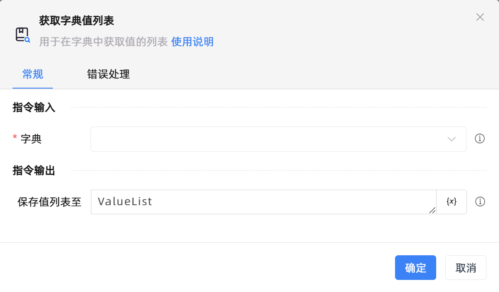
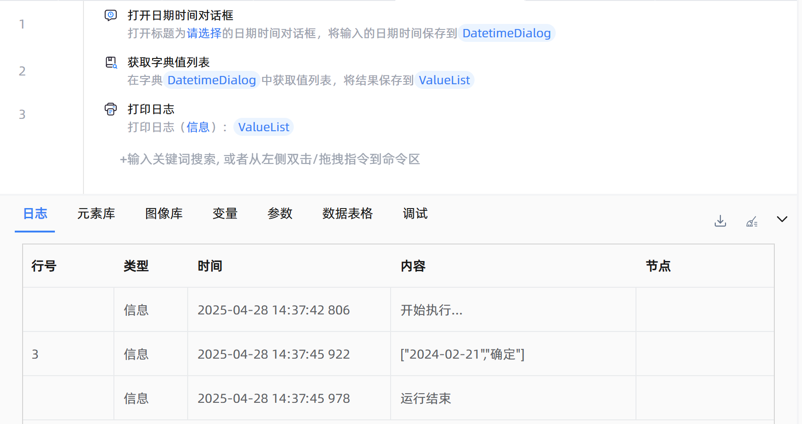

# 获取字典值列表
- 适用系统: windows / 信创

## 功能说明

:::tip 功能描述
用于在字典中获取值的列表
:::

## 配置项说明

### 常规

**指令输入**

- **字典**`TRPADictionary`: 请输入字典变量

**指令输出**

- **保存值列表至**`TList<String>`: 输入一个变量，用于保存查找到的值列表

### 错误处理

- **打印错误日志**`Boolean`：当指令运行出错时，打印错误日志到【日志】面板。默认勾选。

- **处理方式**`Integer`：

    - **终止流程**：指令运行出错时，终止流程。

    - **忽略异常并继续执行**：指令运行出错时，忽略异常，继续执行流程。

    - **重试此指令**：指令运行出错时，重试运行指定次数指令，每次重试间隔指定时长。

## 使用示例

**流程逻辑描述：** 使用【打开日期时间对话框】指令打开一个日期选择对话框，并将用户选择的日期时间、操作的按钮保存到字典变量 --> 使用【获取字典值列表】指令获取对话框选择结果字典值，并将结果保存到列表变量 --> 使用【打印日志】指令将值列表打印输出

## 常见错误及处理

无

## 常见问题解答

无

