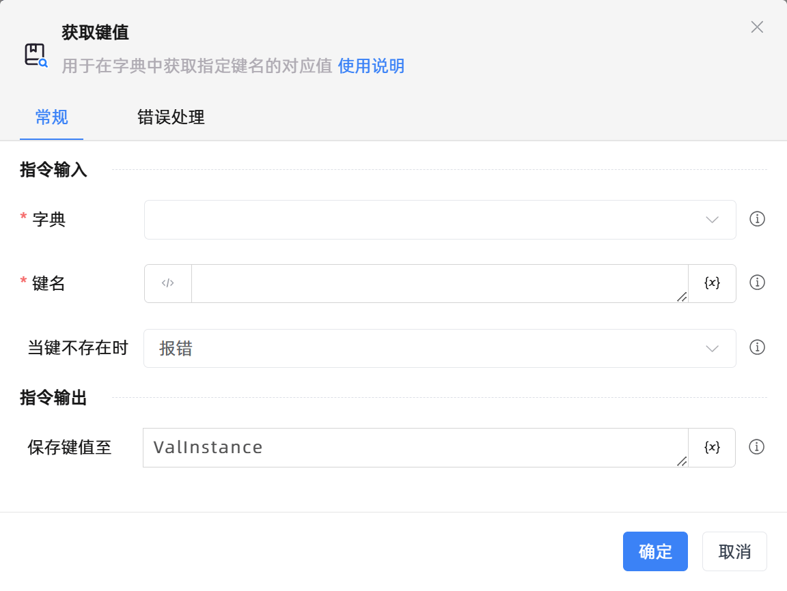

# 获取键值

## 功能说明

:::tip 功能描述
用于在字典中获取指定键名的对应值
:::

## 配置项说明

### 常规

**指令输入**

- **字典**`TRPADictionary`: 请输入字典变量

- **键名**`string`: 请输入键名

- **当键不存在时**`Integer`: 当输入的键不存在时的处理方式

- **默认值**`string`: 请输入默认键值

**指令输出**

- **保存键值至**`string`: 指定一个变量，用于保存查找到的键值

### 错误处理

- **打印错误日志**`Boolean`：当指令运行出错时，打印错误日志到【日志】面板。默认勾选。

- **处理方式**`Integer`：

 - **终止流程**：指令运行出错时，终止流程。

 - **忽略异常并继续执行**：指令运行出错时，忽略异常，继续执行流程。

 - **重试此指令**：指令运行出错时，重试运行指定次数指令，每次重试间隔指定时长。

## 使用示例

**流程逻辑描述：** 

## 常见错误及处理

无

## 常见问题解答

无

