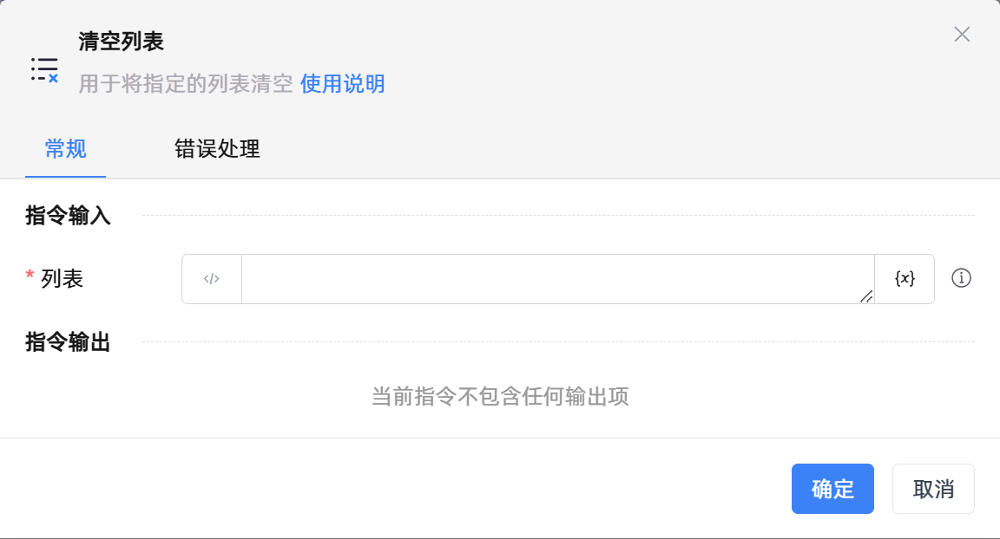

# 清空列表
- 适用系统: windows / 信创

## 功能说明

:::tip 功能描述
用于将指定的列表清空
:::

## 配置项说明

### 常规

**指令输入**

- **列表**`TList<TObject>`: 请输入列表变量

**指令输出**

当前指令无输出

### 错误处理

- **打印错误日志**`Boolean`：当指令运行出错时，打印错误日志到【日志】面板。默认勾选。

- **处理方式**`Integer`：

    - **终止流程**：指令运行出错时，终止流程。

    - **忽略异常并继续执行**：指令运行出错时，忽略异常，继续执行流程。

    - **重试此指令**：指令运行出错时，重试运行指定次数指令，每次重试间隔指定时长。

## 使用示例

**流程逻辑描述：** 使用【新建列表】指令新建一个空列表 --> 使用【列表插入一项】指令，在已创建的列表末尾追加一项 --> 使用【清空列表】指令将列表内容清空 --> 使用【打印日志】指令将结果列表打印输出，查看是否为空列表

## 常见错误及处理

无

## 常见问题解答

无

