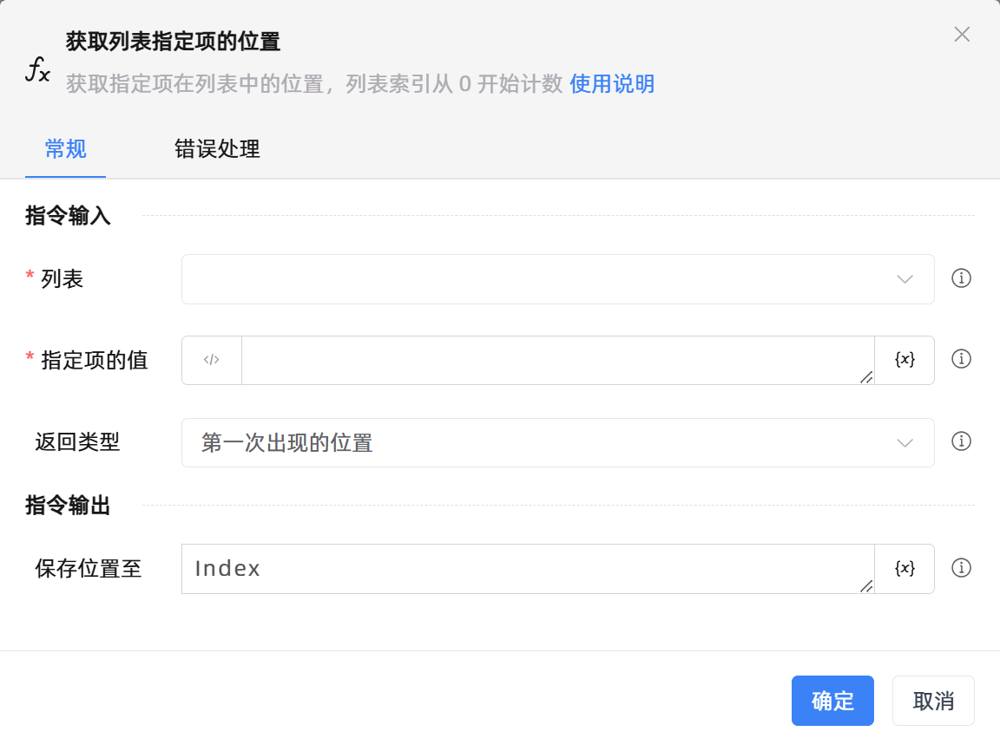

# 获取列表指定项的位置

## 功能说明

:::tip 功能描述
获取指定项在列表中的位置，列表索引从0开始计数,
:::

## 配置项说明

### 常规

**指令输入**

- **列表**`TList<String>`: 请选择字符串列表变量

- **指定项的值**`String`: 请输入列表指定项的值

- **返回类型**`Integer`: 选择返回类型。包括：

    - 第一次出现的位置：仅返回列表项首次出现的位置。如要获取列表`['1','2','1']`中`1`出现的位置，选择返回类型为第一次出现的位置，则返回`0`。

    - 所有位置：返回列表项所有出现过的位置。如要获取列表`['1','2','1']`中`1`出现的位置，选择返回类型为所有位置，则返回`["0","2"]`。

**指令输出**

- **保存位置至**`Integer`: 指定一个变量，保存查找到的指定项在列表中首次出现的位置，返回为-1则表示列表中不存在该项

- **保存位置至**`TList<String>`: 指定一个变量，保存查找到的指定项在列表中所有出现过的位置，返回空列表则表示列表中不存在该项

### 错误处理

- **打印错误日志**`Boolean`：当指令运行出错时，打印错误日志到【日志】面板。默认勾选。

- **处理方式**`Integer`：

    - **终止流程**：指令运行出错时，终止流程。

    - **忽略异常并继续执行**：指令运行出错时，忽略异常，继续执行流程。

    - **重试此指令**：指令运行出错时，重试运行指定次数指令，每次重试间隔指定时长。

## 使用示例

**流程逻辑描述：** 使用【设置变量】指令设置列表变量List1 --> 使用【获取列表指定项的位置】指令，获取列表对象List1中的项'Apple'所有出现的位置 --> 使用【打印日志】指令将位置列表打印输出

## 常见错误及处理

无

## 常见问题解答

无

