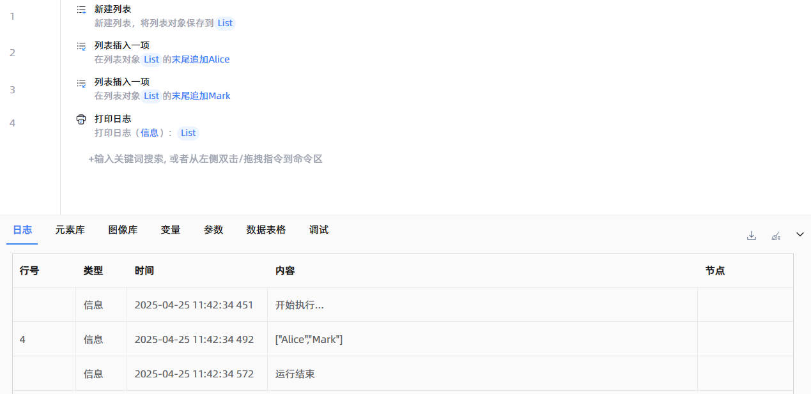

# 列表插入一项
- 适用系统: windows / 信创

## 功能说明

:::tip 功能描述
在列表中的指定位置插入一项
:::

## 配置项说明

### 常规

**指令输入**

- **列表**`TList<String>`: 输入列表变量

- **插入方式**`Integer`: 在列表的末尾或指定的位置插入新的一项

- **插入到:**`Integer`: 输入待插入的位置。正序从0开始，第一项填写0，第二项填写1，以此类推；倒序从 -1 开始，倒数第一项填写-1，倒数第二项填写-2，以此类推。插入后原项将会被后移

- **插入项内容**`String`: 输入待插入的项内容

**指令输出**

当前指令无输出

### 错误处理

- **打印错误日志**`Boolean`：当指令运行出错时，打印错误日志到【日志】面板。默认勾选。

- **处理方式**`Integer`：

    - **终止流程**：指令运行出错时，终止流程。

    - **忽略异常并继续执行**：指令运行出错时，忽略异常，继续执行流程。

    - **重试此指令**：指令运行出错时，重试运行指定次数指令，每次重试间隔指定时长。

## 使用示例

**流程逻辑描述：** 使用【新建列表】指令新建空列表 --> 使用【列表插入一项】指令，依次往空列表中插入'Alice'、'Mark' --> 使用【打印日志】指令将列表打印输出

## 常见错误及处理

无

## 常见问题解答

无

