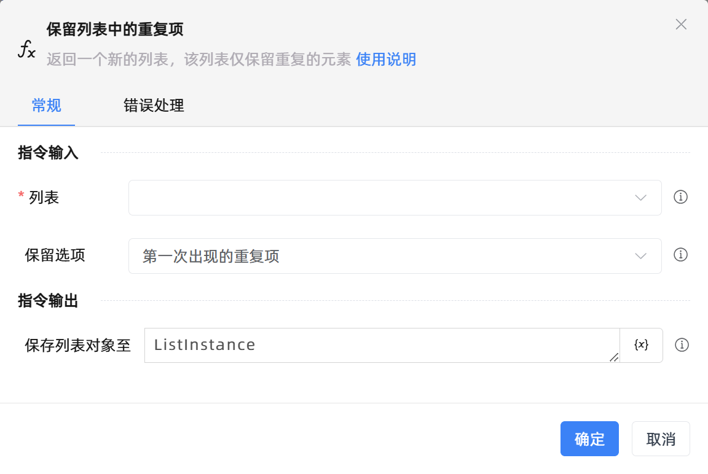
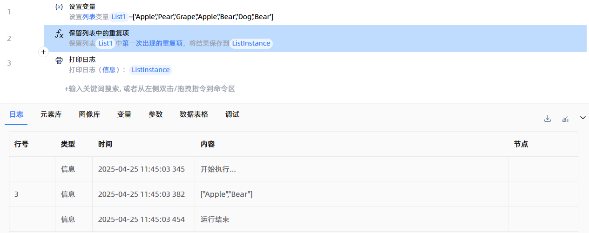

# 保留列表中的重复项

## 功能说明

:::tip 功能描述
返回一个新的列表，该列表仅保留重复的元素
:::

## 配置项说明

### 常规

**指令输入**

- **列表**`TList<String>`: 输入列表变量

- **保留选项**`Integer`: 选择重复项保留方式。包括：

    - 第一次出现的重复项：每个重复元素只保留第一次出现的那个。如列表`['1','3','4','1','4']`，选择保留第一次出现的重复项，结果为`['1','4']`

    - 所有重复项：保留所有重复的元素，不进行去重。如列表`['1','3','4','1','4']`，选择保留所有重复项，结果为`['1','1','4','4']`

**指令输出**

- **保存列表对象至**`TList<String>`: 指定一个变量，用于保存新建的列表

### 错误处理

- **打印错误日志**`Boolean`：当指令运行出错时，打印错误日志到【日志】面板。默认勾选。

- **处理方式**`Integer`：

    - **终止流程**：指令运行出错时，终止流程。

    - **忽略异常并继续执行**：指令运行出错时，忽略异常，继续执行流程。

    - **重试此指令**：指令运行出错时，重试运行指定次数指令，每次重试间隔指定时长。

## 使用示例

**流程逻辑描述：** 使用【设置变量】指令创建一个列表变量 --> 使用【保留列表中的重复项】指令保留列表中的重复元素，并保存至新的列表 --> 使用【打印日志】指令将新列表打印输出

## 常见错误及处理

无

## 常见问题解答

无

