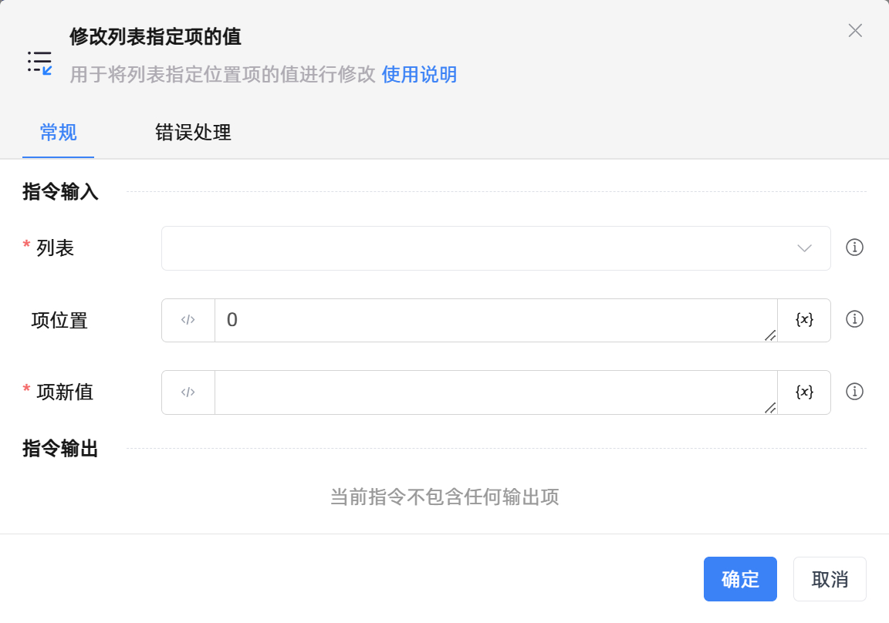

# 修改列表指定项的值

## 功能说明

:::tip 功能描述
用于将列表指定位置项的值进行修改
:::

## 配置项说明

### 常规

**指令输入**

- **列表**`TList<String>`: 输入列表变量

- **项位置**`Integer`: 输入项位置索引。正序从0开始，第一项填写0，第二项填写1，以此类推；倒序从 -1 开始，倒数第一项填写-1，倒数第二项填写-2，以此类推

- **项新值**`String`: 请输入新的值

**指令输出**

当前指令无输出

### 错误处理

- **打印错误日志**`Boolean`：当指令运行出错时，打印错误日志到【日志】面板。默认勾选。

- **处理方式**`Integer`：

 - **终止流程**：指令运行出错时，终止流程。

 - **忽略异常并继续执行**：指令运行出错时，忽略异常，继续执行流程。

 - **重试此指令**：指令运行出错时，重试运行指定次数指令，每次重试间隔指定时长。

## 使用示例
无

## 常见错误及处理

无

## 常见问题解答

无

