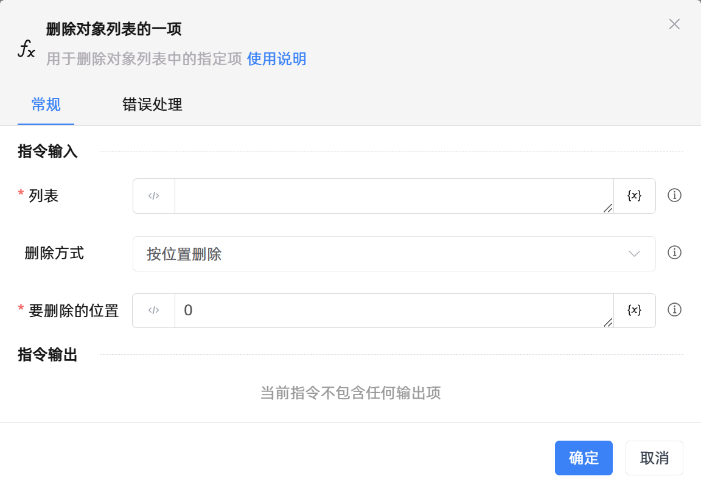

# 删除对象列表的一项

## 功能说明

:::tip 功能描述
用于删除对象列表中的指定项
:::

## 配置项说明

### 常规

**指令输入**

- **列表**`TList<TObject>`: 请输入对象列表变量

- **删除方式**`Integer`: 选择按位置删除(位置索引从0开始)或者按对象删除

- **要删除的对象**`TObject`: 请输入待删除的对象

- **要删除的位置**`Integer`: 输入删除的位置。正序从0开始，第一项填写0，第二项填写1，以此类推；倒序从 -1 开始，倒数第一项填写-1，倒数第二项填写-2，以此类推

**指令输出**

当前指令无输出

### 错误处理

- **打印错误日志**`Boolean`：当指令运行出错时，打印错误日志到【日志】面板。默认勾选。

- **处理方式**`Integer`：

    - **终止流程**：指令运行出错时，终止流程。

    - **忽略异常并继续执行**：指令运行出错时，忽略异常，继续执行流程。

    - **重试此指令**：指令运行出错时，重试运行指定次数指令，每次重试间隔指定时长。

## 使用示例
无

## 常见错误及处理

无

## 常见问题解答

无

