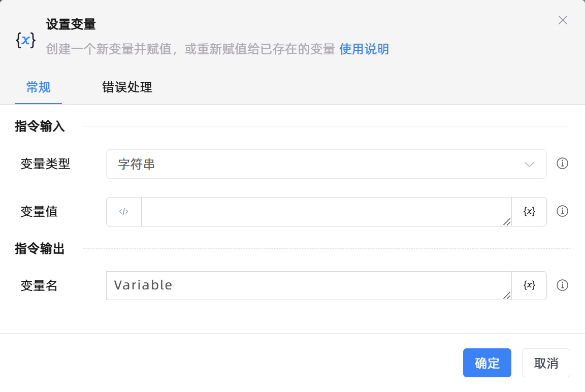

# 设置变量

## 功能说明

:::tip 功能描述
创建一个新变量并赋值，或重新赋值给已存在的变量
:::

## 配置项说明

### 常规

**指令输入**

- **变量类型**`Integer`: 根据变量值选择相应的类型

- **变量值**`Variant`: 指定变量中保存的值

**指令输出**

- **变量名**`Variant`: 输入一个名称作为变量名，将变量的值保存至此变量中

### 错误处理

- **打印错误日志**`Boolean`：当指令运行出错时，打印错误日志到【日志】面板。默认勾选。

- **处理方式**`Integer`：

 - **终止流程**：指令运行出错时，终止流程。

 - **忽略异常并继续执行**：指令运行出错时，忽略异常，继续执行流程。

 - **重试此指令**：指令运行出错时，重试运行指定次数指令，每次重试间隔指定时长。

## 使用示例

**流程逻辑描述：** 

## 常见错误及处理

无

## 常见问题解答

无

