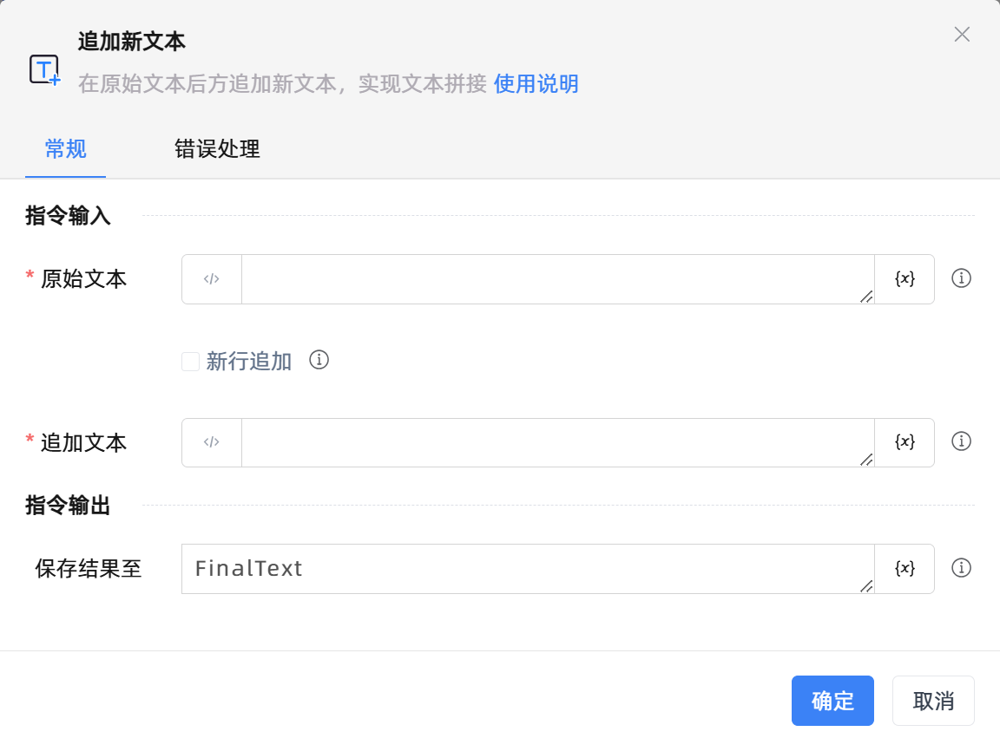

# 追加新文本

## 功能说明

:::tip 功能描述
在原始文本后方追加新文本，实现文本拼接
:::

## 配置项说明

### 常规

**指令输入**

- **原始文本**`string`: 输入文本字符串或一个变量

- **新行追加**`Boolean`: 是否换行追加

- **追加文本**`string`: 输入文本字符串或一个变量

**指令输出**

- **保存结果至**`string`: 指定一个变量保存结果。如果变量名与原始文本变量名相同，将发生覆盖

### 错误处理

- **打印错误日志**`Boolean`：当指令运行出错时，打印错误日志到【日志】面板。默认勾选。

- **处理方式**`Integer`：

    - **终止流程**：指令运行出错时，终止流程。

    - **忽略异常并继续执行**：指令运行出错时，忽略异常，继续执行流程。

    - **重试此指令**：指令运行出错时，重试运行指定次数指令，每次重试间隔指定时长。

## 使用示例
无

## 常见错误及处理

无

## 常见问题解答

无

