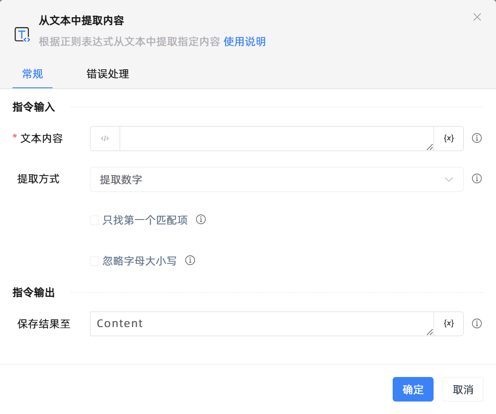

# 从文本中提取内容

## 功能说明

:::tip 功能描述
根据正则表达式从文本中提取指定内容
:::

## 配置项说明

### 常规

**指令输入**

- **文本内容**`string`: 请输入文本字符串或者选择一个包含字符串的变量

- **提取方式**`Integer`: 选择一种内容的提取方式

- **正则表达式**`string`: 请输入一段正则表达式

- **只找第一个匹配项**`Boolean`: 例如在文本中找到了两个手机号，你可以只取第一个

- **忽略大小写**`Boolean`: 在字符串匹配时，是否忽略大小写

**指令输出**

- **保存结果至**`string`: 指定一个变量，用来保存提取到的内容

### 错误处理

- **打印错误日志**`Boolean`：当指令运行出错时，打印错误日志到【日志】面板。默认勾选。

- **处理方式**`Integer`：

 - **终止流程**：指令运行出错时，终止流程。

 - **忽略异常并继续执行**：指令运行出错时，忽略异常，继续执行流程。

 - **重试此指令**：指令运行出错时，重试运行指定次数指令，每次重试间隔指定时长。

## 使用示例

**流程逻辑描述：** 

## 常见错误及处理

无

## 常见问题解答

无

