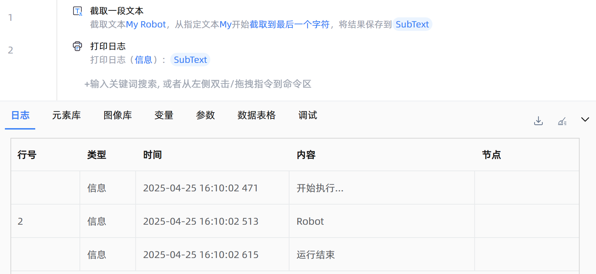

# 截取一段文本
- 适用系统: windows / 信创

## 功能说明

:::tip 功能描述
用于在指定字符串中截取一段子文本
:::

## 配置项说明

### 常规

**指令输入**

- **文本内容**`string`: 请输入文本或选择一个字符串变量。

- **起始位置**`Integer`: 指定起始字符的位置。包括：

    - 从第一个字符开始截取：从文本内容的第一个字符开始截取，相当于起始字符的位置为`0`。当你想从文本的开头提取内容时可以选择该项。

    - 从指定位置开始截取：从文本内容中的指定位置开始截取。需提供一个整数，表示字符的起始位置。

    - 从指定文本开始截取：从文本中某一指定的子文本开始截取。你需要提供一个子字符串作为起始文本，系统会从该子文本首次出现的位置开始截取。

- **起始字符的位置**`Integer`: 从哪个位置开始截取。例如，你想要在文本`但愿人长久，千里共婵娟`中提取`千里`两个字，那么起始位置就是`6`。

- **起始文本**`string`: 从哪个文本开始截取。例如，你想要在文本`联系电话:13821535999`中提取手机号，那么起始文本可以为`:`或`联系电话:`。

- **结果包含起始文本**`Boolean`: 若选择此选项，结果中包含起始文本。例如文本内容为`收货地址:北京市东城区`，起始文本设置为`:`，勾选后的结果为`:北京市东城区`，不勾选的结果为`北京市东城区`。

- **截取方式**`Integer`: 选择截取方式。包括：

    - 截取到最后一个字符：从起始位置开始截取到最后一个字符。
    
    - 截取指定长度：从起始位置开始截取指定数量字符。

- **截取长度**`Integer`: 要截取的字符数量，`0`表示不截取，`1`表示截取一个字符，依此类推。

**指令输出**

- **保存结果至**`string`: 指定一个变量，用来保存截取到的文本内容。

### 错误处理

- **打印错误日志**`Boolean`：当指令运行出错时，打印错误日志到【日志】面板。默认勾选。

- **处理方式**`Integer`：

    - **终止流程**：指令运行出错时，终止流程。

    - **忽略异常并继续执行**：指令运行出错时，忽略异常，继续执行流程。

    - **重试此指令**：指令运行出错时，重试运行指定次数指令，每次重试间隔指定时长。

## 使用示例

**流程逻辑描述：** 使用【截取一段文本】指令将源内容从指定文本开始截取到文末 --> 使用【打印日志】指令打印输出结果文本

## 常见错误及处理

无

## 常见问题解答

无

