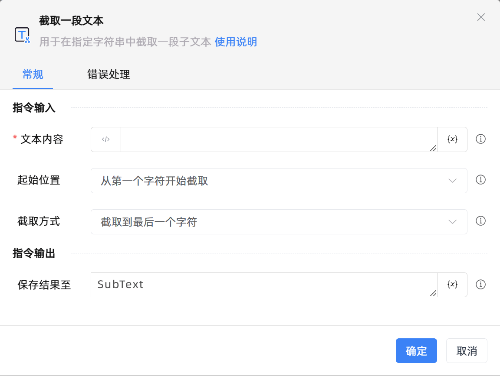

# 截取一段文本

## 功能说明

:::tip 功能描述
用于在指定字符串中截取一段子文本
:::

## 配置项说明

### 常规

**指令输入**

- **文本内容**`string`: 请输入文本字符串或一个变量

- **起始位置**`Integer`: 指定起始字符的位置

- **起始字符的位置**`Integer`: 例如，你想要在文本(但愿人长久，千里共婵娟)中提取(千里)两个字那么起始位置就是6

- **起始文本**`string`: 例如，你想要在文本(联系电话:13821535999)中提取手机号，那么起始文本就是(:)

- **结果包含起始文本**`Boolean`: 若选择此选项，结果中包含起始文本，例如文本设置为(收货地址:北京市东城区)，起始文本设置为(:)，勾选后的结果为(:北京市东城区)，不勾选的结果为(北京市东城区)

- **截取方式**`Integer`: 若你需要从文本(但愿人长久，千里共婵娟)中提取(千里)两个字，那么起始位置就是6,截取长度为2,代表从第7个字符开始截取，截取的长度为两个字符

- **截取长度**`Integer`: 指定你要截取的字符数量

**指令输出**

- **保存结果至**`string`: 指定一个变量，用来保存截取到的文本内容

### 错误处理

- **打印错误日志**`Boolean`：当指令运行出错时，打印错误日志到【日志】面板。默认勾选。

- **处理方式**`Integer`：

 - **终止流程**：指令运行出错时，终止流程。

 - **忽略异常并继续执行**：指令运行出错时，忽略异常，继续执行流程。

 - **重试此指令**：指令运行出错时，重试运行指定次数指令，每次重试间隔指定时长。

## 使用示例
无

## 常见错误及处理

无

## 常见问题解答

无

