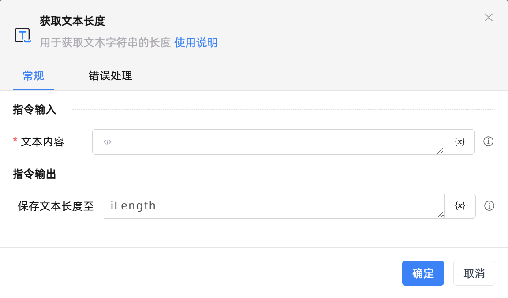
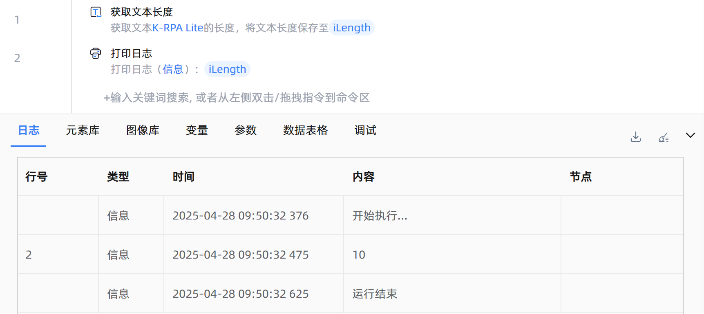

# 获取文本长度
- 适用系统: windows / 信创

## 功能说明

:::tip 功能描述
用于获取文本字符串的长度
:::

## 配置项说明

### 常规

**指令输入**

- **文本内容**`string`: 输入文本或选择一个字符串变量

**指令输出**

- **保存文本长度至**`Integer`: 指定一个变量，用来保存文本内容的长度

### 错误处理

- **打印错误日志**`Boolean`：当指令运行出错时，打印错误日志到【日志】面板。默认勾选。

- **处理方式**`Integer`：

    - **终止流程**：指令运行出错时，终止流程。

    - **忽略异常并继续执行**：指令运行出错时，忽略异常，继续执行流程。

    - **重试此指令**：指令运行出错时，重试运行指定次数指令，每次重试间隔指定时长。

## 使用示例

**流程逻辑描述：** 使用【获取文本长度】指令获取文本'K-RPA Lite'的长度，并将结果保存到一个整型变量中 --> 使用【打印日志】指令打印输出结果

## 常见错误及处理

无

## 常见问题解答

无

