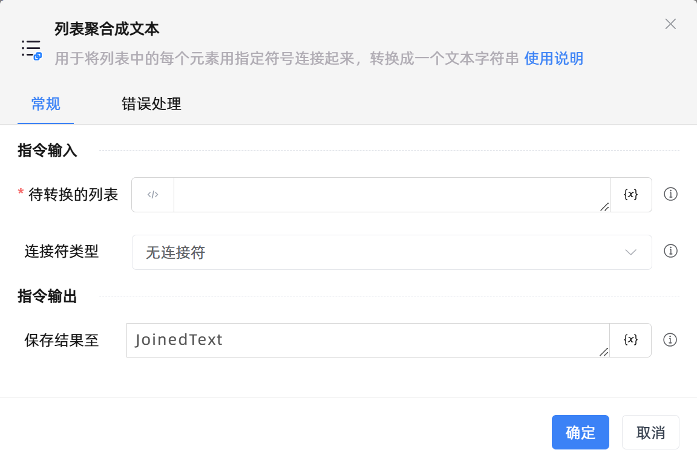

# 列表聚合成文本

## 功能说明

:::tip 功能描述
用于将列表中的每一项用指定符号连接起来，转换成一个文本字符串。
:::

## 配置项说明

### 常规

**指令输入**

- **待转换的列表**`TList<String>`: 请选择一个字符串列表类型的变量。

- **连接符类型**`Integer`: 选择用于连接列表各项的连接符。包括：

    - 无连接符：不使用连接符。例如，待转换的列表为`['Zhuhai','Kingsware']`，选择无连接符，指令输出结果为`ZhuhaiKingsare`。

    - 标准连接符：包括空格符、制表符、换行符。例如，待转换的列表为`['Zhuhai','Kingsware']`，选择1个空格符作为连接符，指令输出结果为`Zhuhai Kingsare`。

    - 自定义连接符：自定义连接符。例如，待转换的列表为`['Zhuhai','Kingsware']`，输入`;`作为连接符，指令输出结果为`Zhuhai;Kingsare`。

- **标准连接符**`Integer`: 请选择一种连接符，包括空格符、制表符、换行符。

- **连接符的数量**`Integer`: 指定连接符的重复次数。`0`表示不使用连接符，`1`表示使用1个标准连接符作为转换后的文本连接符。

- **自定义的连接符**`string`: 输入自定义文本作为连接符。

**指令输出**

- **保存结果至**`string`: 指定一个变量，用来保存列表转换后的文本。

### 错误处理

- **打印错误日志**`Boolean`：当指令运行出错时，打印错误日志到【日志】面板。默认勾选。

- **处理方式**`Integer`：

    - **终止流程**：指令运行出错时，终止流程。

    - **忽略异常并继续执行**：指令运行出错时，忽略异常，继续执行流程。

    - **重试此指令**：指令运行出错时，重试运行指定次数指令，每次重试间隔指定时长。

## 使用示例
无

## 常见错误及处理

无

## 常见问题解答

无

