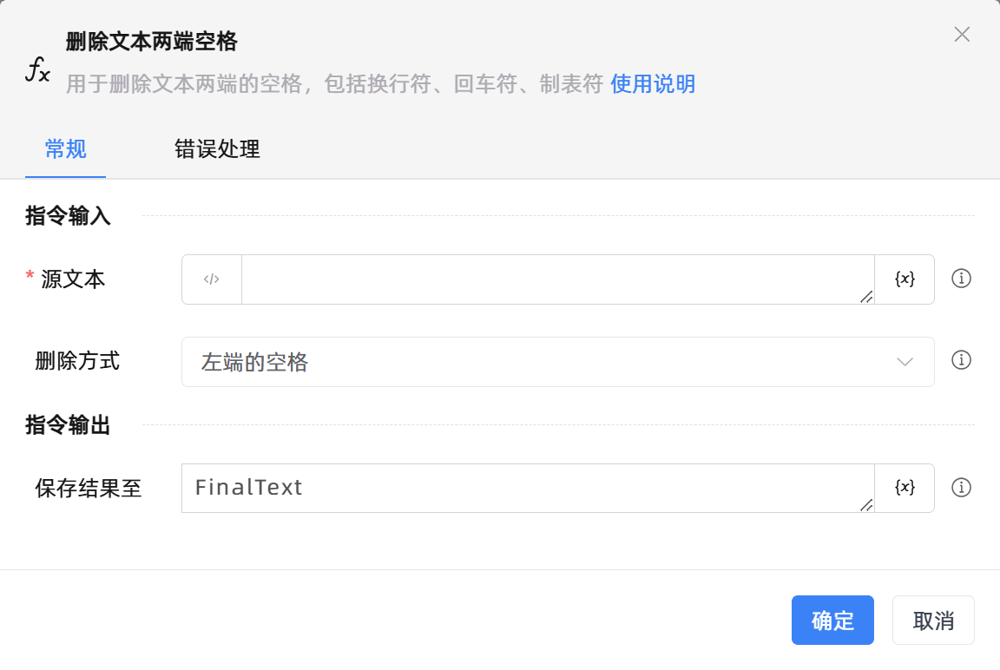

# 删除文本两端空格

## 功能说明

:::tip 功能描述
用于删除文本两端的空格，包括空格、换行符、回车符、制表符
:::

## 配置项说明

### 常规

**指令输入**

- **源文本**`string`: 待处理的文本。请输入字符串或选择一个字符串变量。

- **删除方式**`Integer`: 指定要删除文本哪一侧的空格。包括：

    - 左端的空格：删除源文本左端的空格。比如源文本为`  Zhuhai Kingsware `，选择删除左端的空格，则运行结果为`Zhuhai Kingsware `。

    - 右端的空格：删除源文本右端的空格。比如源文本为`  Zhuhai Kingsware `，选择删除右端的空格，则运行结果为`  Zhuhai Kingsware`。

    - 两端的空格：删除源文本两端的空格。比如源文本为`  Zhuhai Kingsware `，选择删除两端的空格，则运行结果为`Zhuhai Kingsware`。

**指令输出**

- **保存结果至**`string`: 指定一个变量，用来保存处理后的文本内容。

### 错误处理

- **打印错误日志**`Boolean`：当指令运行出错时，打印错误日志到【日志】面板。默认勾选。

- **处理方式**`Integer`：

    - **终止流程**：指令运行出错时，终止流程。

    - **忽略异常并继续执行**：指令运行出错时，忽略异常，继续执行流程。

    - **重试此指令**：指令运行出错时，重试运行指定次数指令，每次重试间隔指定时长。

## 使用示例
无

## 常见错误及处理

无

## 常见问题解答

无

