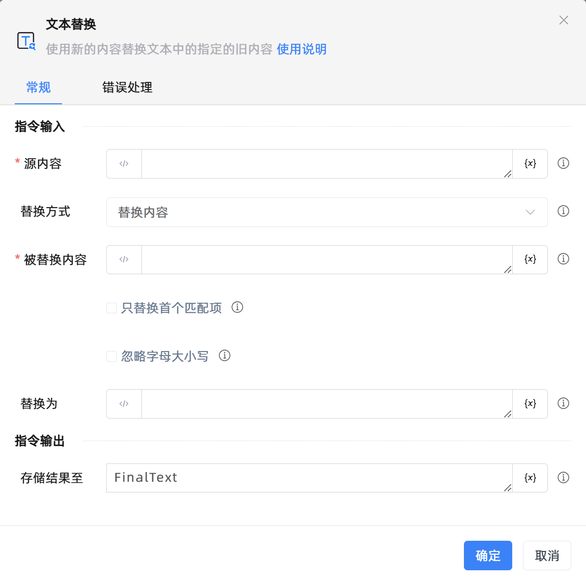
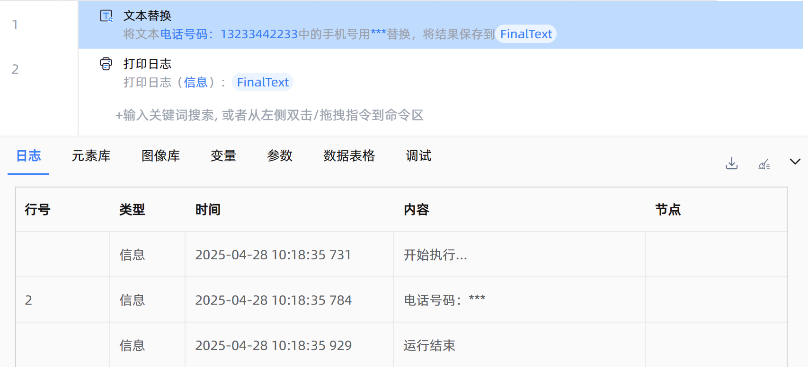

# 文本替换

## 功能说明

:::tip 功能描述
使用新文本替换源内容中的指定文本
:::

## 配置项说明

### 常规

**指令输入**

- **源内容**`string`: 请输入字符串或者选择一个字符串变量。

- **替换方式**`Integer`: 选择待替换的文本。包括：

    - 替换内容：替换源内容中的指定文本。

    - 替换数字：替换源内容中的数字。

    - 替换手机号：替换源内容中的手机号。

    - 替换email：替换源内容中的邮件地址。

    - 替换身份证：替换源内容中的身份证号。

    - 自定义正则替换：输入正则表达式以替换源内容中满足表达式的文本。

- **正则表达式**`string`: 输入正则表达式。

- **被替换内容**`string`: 请输入待替换的内容。

- **只替换首个匹配项**`Boolean`: 若勾选，当在源内容中找到了多个匹配项时，只替换第一个匹配项。

- **忽略字母大小写**`Boolean`: 若勾选，在进行字符串匹配时，忽略字母大小写形式。

- **替换为**`string`: 请输入替换后的内容。

**指令输出**

- **存储结果至**`string`: 指定一个变量，用来保存替换后的内容

### 错误处理

- **打印错误日志**`Boolean`：当指令运行出错时，打印错误日志到【日志】面板。默认勾选。

- **处理方式**`Integer`：

    - **终止流程**：指令运行出错时，终止流程。

    - **忽略异常并继续执行**：指令运行出错时，忽略异常，继续执行流程。

    - **重试此指令**：指令运行出错时，重试运行指定次数指令，每次重试间隔指定时长。

## 使用示例

**流程逻辑描述：** 使用【文本替换】指令将文本'电话号码：13233442233'中的手机号码使用'***'替换，然后将结果保存到一个字符串变量中 --> 使用【打印日志】指令打印输出结果

## 常见错误及处理

无

## 常见问题解答

无

