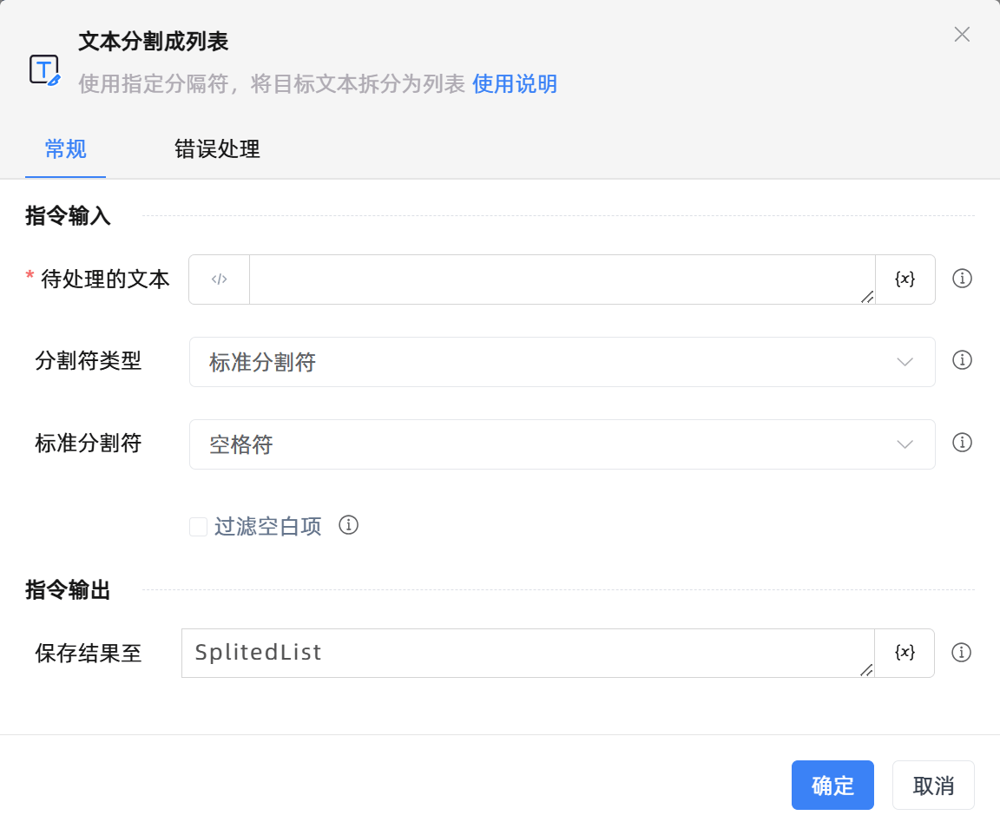

# 文本分割成列表

## 功能说明

:::tip 功能描述
使用指定分隔符，将目标文本拆分为列表
:::

## 配置项说明

### 常规

**指令输入**

- **待处理的文本**`string`: 请输入字符串或者选择一个字符串变量。

- **分割符类型**`Integer`: 选择文本分割符。包括：

    - 标准分割符：使用空格符、制表符或换行符作为文本分割符。

    - 自定义分割符：使用自定义文本作为文本分割符。

- **标准分割符**`Integer`: 包括空格符、制表符和换行符。

- **自定义的连接符**`string`: 输入自定义文本作为文本分割标志，支持正则表达式。

- **正则表达式**`Boolean`: 若勾选，自定义的连接符将被当作正则表达式处理；否则当普通文本处理。例如，使用`\d`作为分割符，若勾选`正则表达式`，则表明使用数字作为分割符，若不勾选，则表明使用文本`\d`作为分割符。

- **过滤空白项**`Boolean`: 自动删除分割出的空白项。例如，待处理的文本为`Jane;;Mark`，使用`;`作为分割符，若勾选`过滤空白项`，则转换后的结果列表为`['Jane','Mark']`，若不勾选，则转换后的结果列表为`['Jane','','Mark']`。

**指令输出**

- **保存结果至**`TList<String>`: 指定一个变量，用来保存文本转换后的列表。

### 错误处理

- **打印错误日志**`Boolean`：当指令运行出错时，打印错误日志到【日志】面板。默认勾选。

- **处理方式**`Integer`：

    - **终止流程**：指令运行出错时，终止流程。

    - **忽略异常并继续执行**：指令运行出错时，忽略异常，继续执行流程。

    - **重试此指令**：指令运行出错时，重试运行指定次数指令，每次重试间隔指定时长。

## 使用示例

**流程逻辑描述：** 使用【文本分割成列表】指令将文本'Alice;Jane'使用';'分割成字符串列表，然后将结果保存到一个字符串列表变量中 --> 使用【ForEach列表循环】指令遍历循环列表中的每一项--> 使用【打印日志】指令打印输出列表项

## 常见错误及处理

无

## 常见问题解答

无

