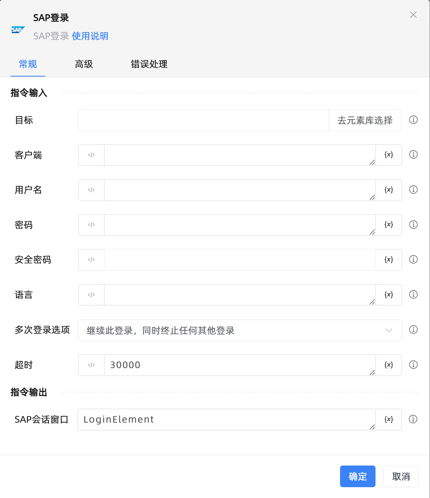

# SAP登录
- 适用系统: windows / 信创

## 功能说明

:::tip 功能描述
SAP登录
:::

## 配置项说明

### 常规

**指令输入**

- **目标**`TTarget`: 目标

- **客户端**`string`: 客户端

- **用户名**`string`: 用户名

- **密码**`string`: 密码

- **安全密码**`string`: 安全密码

- **语言**`string`: 语言

- **多次登录选项**`Integer`: 多次登录选项

- **超时**`Integer`: 登录超时

**指令输出**

- **SAP会话窗口**`TUiElement`: 指定一个变量，用于记录SAP会话窗口

### 高级

- **执行前的延迟(毫秒)**`Integer`: 指令执行前的等待时间

### 错误处理

- **打印错误日志**`Boolean`：当指令运行出错时，打印错误日志到【日志】面板。默认勾选。

- **处理方式**`Integer`：

 - **终止流程**：指令运行出错时，终止流程。

 - **忽略异常并继续执行**：指令运行出错时，忽略异常，继续执行流程。

 - **重试此指令**：指令运行出错时，重试运行指定次数指令，每次重试间隔指定时长。

## 使用示例
无

## 常见错误及处理

无

## 常见问题解答

无

