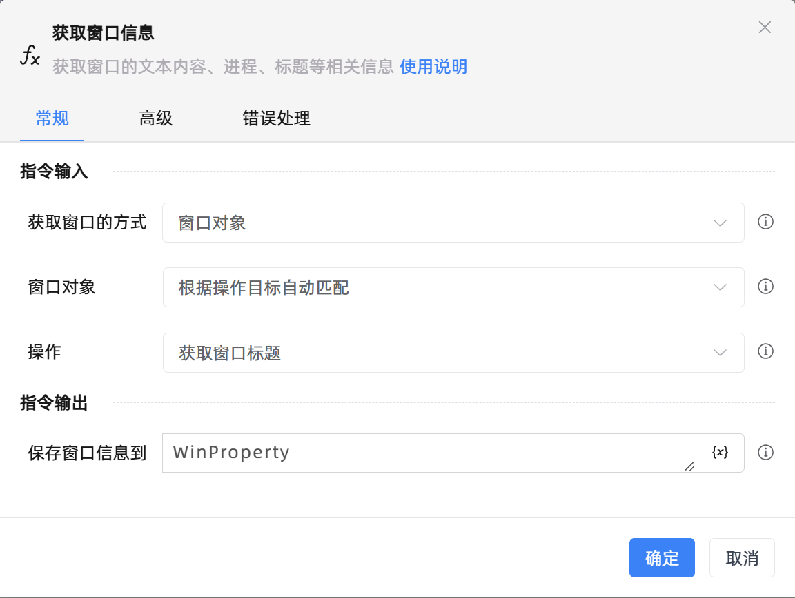

# 获取窗口信息

## 功能说明

:::tip 功能描述
获取窗口的文本内容、进程、标题等相关信息
:::

## 配置项说明

### 常规

**指令输入**

- **获取窗口的方式**`Integer`: 选择获取窗口的方式

- **窗口对象**`TWinObj`: 指定一个捕获到的窗口对象

- **操作目标元素**`TTarget`: 选择窗口元素

- **窗口的标题**`string`: 输入窗口的标题

- **添加窗口的类型**`Boolean`: 添加窗口的类型

- **窗口类型**`string`: 输入窗口的类型

- **根据通配符进行匹配**`Boolean`: 根据通配符进行匹配

- **操作**`Integer`: 选择窗口的操作方式

**指令输出**

- **保存窗口信息到**`string`: 保存的是窗口的属性对象

### 高级

- **执行前的延迟(毫秒)**`Integer`: 指令执行前的等待时间

### 错误处理

- **打印错误日志**`Boolean`：当指令运行出错时，打印错误日志到【日志】面板。默认勾选。

- **处理方式**`Integer`：

 - **终止流程**：指令运行出错时，终止流程。

 - **忽略异常并继续执行**：指令运行出错时，忽略异常，继续执行流程。

 - **重试此指令**：指令运行出错时，重试运行指定次数指令，每次重试间隔指定时长。

## 使用示例
无

## 常见错误及处理

无

## 常见问题解答

无

