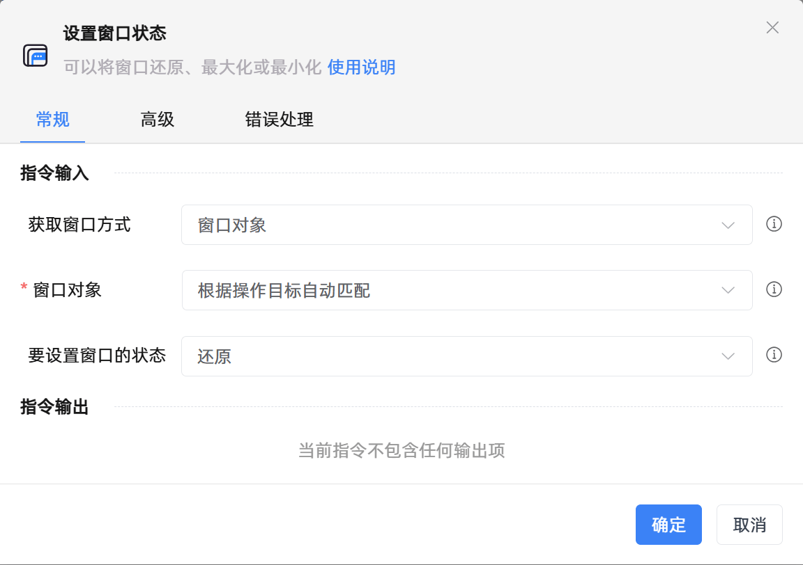

# 设置窗口状态

## 功能说明

:::tip 功能描述
可以将窗口还原、最大化或最小化
:::

## 配置项说明

### 常规

**指令输入**

- **获取窗口方式**`Integer`: 选择获取窗口的方式

- **窗口对象**`TWinObj`: 指定一个捕获到的窗口对象

- **操作目标元素**`TTarget`: 指定一个需要操作的目标窗口元素

- **窗口标题**`string`: 请输入窗口标题

- **添加窗口类型**`Boolean`: 添加窗口类型

- **窗口类型**`string`: 输入窗口类型

- **启用通配符匹配**`Boolean`: 根据通配符进行匹配

- **要设置窗口的状态**`Integer`: 设置窗口的状态

**指令输出**

当前指令无输出

### 高级

- **执行前的延迟(毫秒)**`Integer`: 指令执行前的等待时间

### 错误处理

- **打印错误日志**`Boolean`：当指令运行出错时，打印错误日志到【日志】面板。默认勾选。

- **处理方式**`Integer`：

 - **终止流程**：指令运行出错时，终止流程。

 - **忽略异常并继续执行**：指令运行出错时，忽略异常，继续执行流程。

 - **重试此指令**：指令运行出错时，重试运行指定次数指令，每次重试间隔指定时长。

## 使用示例

**流程逻辑描述：** 

## 常见错误及处理

无

## 常见问题解答

无

