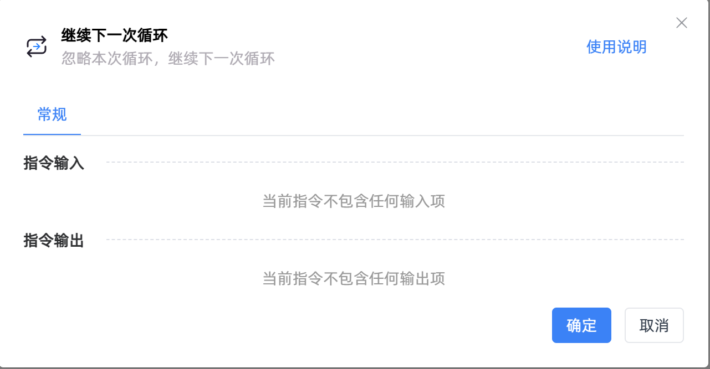
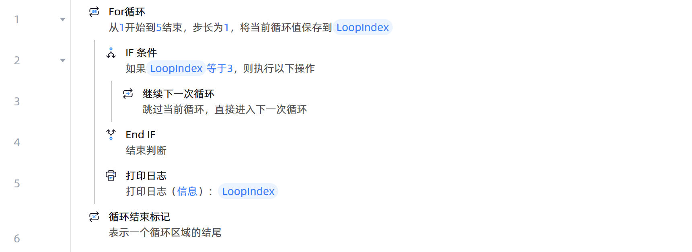

# 继续下一次循环

## 功能说明

:::tip 功能描述
忽略本次循环，继续下一次循环
:::

 

> 注：【继续下一次循环】主要是对【For次数循环】、【ForEach列表循环】、【循环相似元素】等循环指令进行动态的控制

## 使用示例

**流程逻辑描述：** 使用【For循环】设置起始数为1、结束数为5、步长为1 --> 循环体执行【IF 条件】指令判断当前循环值是否等于3 --> 若等于则执行【继续下一次循环】跳过本次循环，直接进入下一次循环--> 否则循环体执行【打印日志】指令打印当前循环值 --> 直至循环结束

