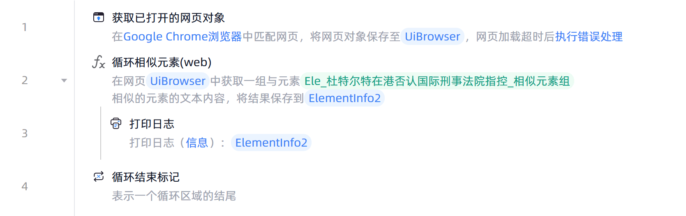

# 循环结束标记

## 功能说明

:::tip 功能描述
表示一个循环区域的结尾
:::

## 配置项说明

### 常规

**指令输入**

当前指令无输入

**指令输出**

当前指令无输出

## 使用示例

**流程逻辑描述：** 获取已打开的网页对象--> 使用【循环相似元素(web)】指令获取元素文本内容 --> 循环体执行【打印日志】指令，打印元素文本内容 --> 直至相似元素组的最后一项 --> 循环结束

## 常见错误及处理

无

## 常见问题解答

无

