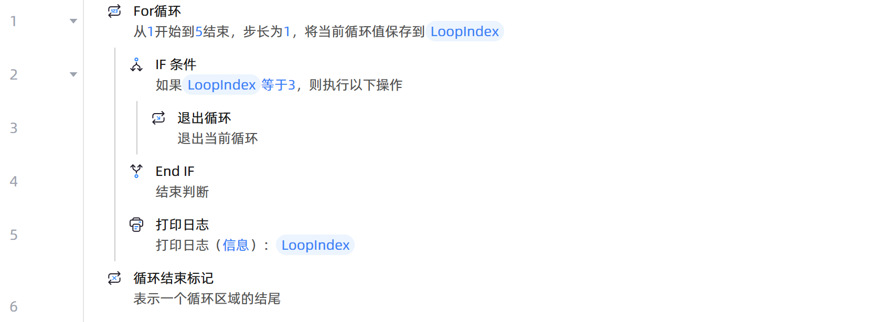

# 退出循环

## 功能说明

:::tip 功能描述
退出当前循环
:::

## 配置项说明

### 常规

**指令输入**

当前指令无输入

**指令输出**

当前指令无输出

## 使用示例

**流程逻辑描述：** 使用【For循环】设置起始数为1、结束数为5、步长为1 --> 循环体执行【IF 条件】指令判断当前循环值是否等于3 --> 若等于则执行【退出循环】结束循环--> 否则循环体执行【打印日志】指令打印当前循环值 --> 直至循环结束

## 常见错误及处理

无

## 常见问题解答

无

